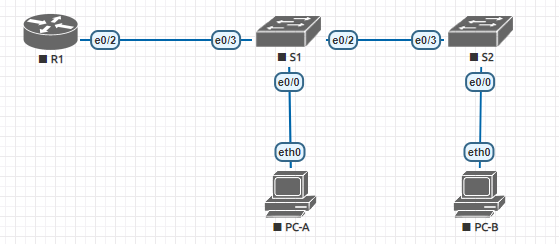

### Задание:

1. Настройка DTP.
2. Добавление сетей VLAN и назначение портов.

###  Решение:
- [Конфигурационные файлы;](configs/)
- [Графическая схема;](README.md#графическая-схема)

**R1:**
```
interface Ethernet0/2
 no shutdown
 no ip address
!
interface Ethernet0/2.3
 no shutdown
 description Management
 encapsulation dot1Q 3
 ip address 192.168.3.1 255.255.255.0
!
interface Ethernet0/2.4
 no shutdown
 description Operations
 encapsulation dot1Q 4
 ip address 192.168.4.1 255.255.255.0
!
interface Ethernet0/2.8
 no shutdown
 description Native
 encapsulation dot1Q 8 native
```

**S1:**
```
interface Ethernet0/0
 no shutdown
 switchport access vlan 3
 switchport mode access
 switchport nonegotiate
!
interface Ethernet0/1
 switchport access vlan 7
 switchport mode access
 switchport nonegotiate
 shutdown
!
interface Ethernet0/2
 no shutdown
 switchport trunk allowed vlan 3,4
 switchport trunk encapsulation dot1q
 switchport trunk native vlan 8
 switchport mode trunk
 switchport nonegotiate
!
interface Ethernet0/3
 no shutdown
 switchport trunk allowed vlan 3,4
 switchport trunk encapsulation dot1q
 switchport trunk native vlan 8
 switchport mode trunk
 switchport nonegotiate
!
interface Vlan3
 no shutdown
 ip address 192.168.3.11 255.255.255.0
```

**S2:**
```
interface Ethernet0/0
 no shutdown
 switchport access vlan 4
 switchport mode access
 switchport nonegotiate
!
interface Ethernet0/1
 switchport access vlan 7
 switchport mode access
 switchport nonegotiate
 shutdown
!
interface Ethernet0/2
 switchport access vlan 7
 switchport mode access
 switchport nonegotiate
 shutdown
!
interface Ethernet0/3
 no shutdown
 switchport trunk allowed vlan 3,4
 switchport trunk encapsulation dot1q
 switchport trunk native vlan 8
 switchport mode trunk
 switchport nonegotiate
!
interface Vlan3
 no shutdown
 ip address 192.168.3.12 255.255.255.0
```

+ По заданию в лабе, было добавление имен для VLAN

S1 и S2:
```
vlan 3
 name Management
!
vlan 4
 name Operations
!
vlan 7
 name ParkingLot
!
vlan 8
 name Native
```

### Графическая схема

