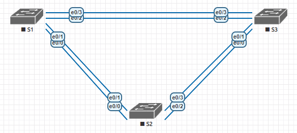
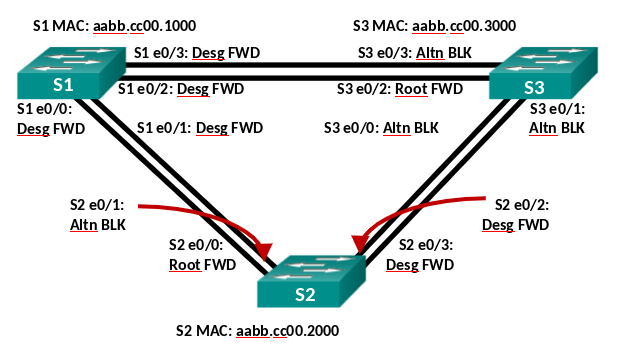

### Задание:

Создание сети и настройка основных параметров устройства.
Выбор корневого моста.
Наблюдение за процессом выбора протоколом STP порта, исходя из стоимости портов.
Наблюдение за процессом выбора протоколом STP порта, исходя из приоритета портов.

###  Решение:
- [Конфигурационные файлы;](configs/)
- [Сохраненная топология из EVE-NG;](eve-ng_lab_STP.zip)

### Графическая схема:



Конфигурация STP и транков на всех коммутаторах:
```
conf t
spanning-tree mode pvst
interface range e0/0-3
 no shutdown
 switchport trunk encapsulation dot1q
 switchport mode trunk
 switchport nonegotiate
 spanning-tree link-type point-to-point
```

### Вопросы из лабораторной работы:



- С учетом выходных данных, поступающих с коммутаторов, ответьте на следующие вопросы.
Какой коммутатор является корневым мостом?
**S1**
- Почему этот коммутатор был выбран протоколом spanning-tree в качестве корневого моста?
**Наименьший BID**
- Какие порты на коммутаторе являются корневыми портами?
**S2: e0/0
S3: e0/2**
- Какие порты на коммутаторе являются назначенными портами?
**S1: e0/0, e0/1, e0/2, e0/3
S2: e0/2, e0/3**
- Какой порт отображается в качестве альтернативного и в настоящее время заблокирован?
**S2: e0/1
S3: e0/0, e0/1, e0/3**
- Почему протокол spanning-tree выбрал этот порт в качестве невыделенного (заблокированного) порта?
**STA подсчитал это на основе стоимости, BID, приоритета, или если со стороны корневого моста будет наименьший номер порта при одинаковом значении стоимости, BID и приоритета.**
------------
### Наблюдение за процессом выбора протоколом STP порта, исходя из стоимости портов
(Предварительно блокируем e0/0 и e0/2 на каждом коммутаторе)
```
conf t
int range e0/0,e0/2
shutdown
```
Шаг 1:	Определим коммутатор с заблокированным портом.
```
S2#show spanning-tree

VLAN0001
  Spanning tree enabled protocol ieee
  Root ID    Priority    32769
             Address     aabb.cc00.1000
             Cost        100
             Port        2 (Ethernet0/1)
             Hello Time   2 sec  Max Age 20 sec  Forward Delay 15 sec

  Bridge ID  Priority    32769  (priority 32768 sys-id-ext 1)
             Address     aabb.cc00.2000
             Hello Time   2 sec  Max Age 20 sec  Forward Delay 15 sec
             Aging Time  300 sec

Interface           Role Sts Cost      Prio.Nbr Type
------------------- ---- --- --------- -------- --------------------------------
Et0/1               Root FWD 100       128.2    P2p
Et0/3               Desg FWD 100       128.4    P2p

S3#show spanning-tree

VLAN0001
  Spanning tree enabled protocol ieee
  Root ID    Priority    32769
             Address     aabb.cc00.1000
             Cost        100
             Port        4 (Ethernet0/3)
             Hello Time   2 sec  Max Age 20 sec  Forward Delay 15 sec

  Bridge ID  Priority    32769  (priority 32768 sys-id-ext 1)
             Address     aabb.cc00.3000
             Hello Time   2 sec  Max Age 20 sec  Forward Delay 15 sec
             Aging Time  300 sec

Interface           Role Sts Cost      Prio.Nbr Type
------------------- ---- --- --------- -------- --------------------------------
Et0/1               Altn BLK 100       128.2    P2p
Et0/3               Root FWD 100       128.4    P2p
```
Заблокирован порт e0/1 (линк между S2 и S3) коммутатора S3, так как S3 имеет самое высокое значение BID.

Шаг 2: Меняем стоимость порта.
А именно e0/1 на S3 т.к. он Root.
```
S3#conf t
S3(config)#int e0/3
S3(config-if)#spanning-tree cost 99
```
Шаг 3: Смотрим изменения протокола spanning-tree.
```
S2#show spanning-tree

VLAN0001
  Spanning tree enabled protocol ieee
  Root ID    Priority    32769
             Address     aabb.cc00.1000
             Cost        100
             Port        2 (Ethernet0/1)
             Hello Time   2 sec  Max Age 20 sec  Forward Delay 15 sec

  Bridge ID  Priority    32769  (priority 32768 sys-id-ext 1)
             Address     aabb.cc00.2000
             Hello Time   2 sec  Max Age 20 sec  Forward Delay 15 sec
             Aging Time  300 sec

Interface           Role Sts Cost      Prio.Nbr Type
------------------- ---- --- --------- -------- --------------------------------
Et0/1               Root FWD 100       128.2    P2p
Et0/3               Altn BLK 100       128.4    P2p

S3#show spanning-tree

VLAN0001
  Spanning tree enabled protocol ieee
  Root ID    Priority    32769
             Address     aabb.cc00.1000
             Cost        99
             Port        4 (Ethernet0/3)
             Hello Time   2 sec  Max Age 20 sec  Forward Delay 15 sec

  Bridge ID  Priority    32769  (priority 32768 sys-id-ext 1)
             Address     aabb.cc00.3000
             Hello Time   2 sec  Max Age 20 sec  Forward Delay 15 sec
             Aging Time  300 sec

Interface           Role Sts Cost      Prio.Nbr Type
------------------- ---- --- --------- -------- --------------------------------
Et0/1               Desg FWD 100       128.2    P2p
Et0/3               Root FWD 99        128.4    P2p

```
- Почему протокол spanning-tree заменяет ранее заблокированный порт на назначенный порт и блокирует порт, который был назначенным портом на другом коммутаторе?
**Появилась разница в стоимости пути. Ранее стоимость была одинаковая и роль определялась по меньшему значению BID.**

Шаг 4:	Удаляем изменения стоимости порта.
```
S3#conf t
S3(config)#int e0/3
S3(config-if)#no spanning-tree cost 99
```
Состояние портов возвращается к шагу 1.

(Разблокируем e0/0 и e0/2 на каждом коммутаторе)
```
conf t
int range e0/0,e0/2
no shutdown
```

------------
- Какое значение протокол STP использует первым после выбора корневого моста, чтобы определить выбор порта?
**Стоимость**
- Если первое значение на двух портах одинаково, какое следующее значение будет использовать протокол STP при выборе порта?
**BID**
- Если оба значения на двух портах равны, каким будет следующее значение, которое использует протокол STP при выборе порта?
**Приоритет (и номер порта, если приоритет одинаковый)**
