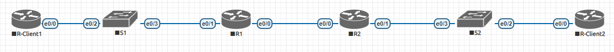

## Задание:

1. Настроить DHCPv4
2. Настроить DHCPv6

##  Решение:

- [Конфигурационные файлы;](configs/)
- [Сохраненная топология из EVE-NG;](eve-ng_lab_DHCP.zip)

### Графическая схема



### Таблица VLAN

| VLAN |     Name    | Interface Assigned |
|:----:|:-----------:|:------------------:|
| 1    | N/A         | S2: e0/0-3         |
| 100  | Clients     | S1: e0/2           |
| 200  | Management  | S1: VLAN 200       |
| 999  | Parking_Lot | S1: e0/0-1         |
| 1000 | Native      |                    |

1. DHCPv4

| Device | Interface |  IP Address  |   Subnet Mask   | Default Gateway |
|:------:|:---------:|:------------:|:---------------:|:---------------:|
| R1     | e0/0      | 10.0.0.1     | 255.255.255.252 |                 |
|        | e0/1      |              |                 |                 |
|        | e0/1.100  | 192.168.1.1  | 255.255.255.192 |                 |
|        | e0/1.200  | 192.168.1.65 | 255.255.255.224 |                 |
|        | e0/1.1000 |              |                 |                 |
| R2     | e0/0      | 10.0.0.2     | 255.255.255.252 |                 |
|        | e0/1      | 192.168.1.97 | 255.255.255.240 |                 |
| S1     | VLAN 200  | 192.168.1.66 | 255.255.255.224 | 192.168.1.65    |
| S2     | VLAN 1    | 192.168.1.98 | 255.255.255.240 | 192.168.1.97    |
| PC-A   | NIC       | DHCP         | DHCP            | DHCP            |
| PC-B   | NIC       | DHCP         | DHCP            | DHCP            |

**R1:**
```{r, echo=FALSE}
!
ip dhcp excluded-address 192.168.1.1 192.168.1.5
ip dhcp excluded-address 192.168.1.97 192.168.1.101
!
ip dhcp pool R1-Client_LAN
 network 192.168.1.0 255.255.255.192
 default-router 192.168.1.1 
 domain-name ccna-lab.com
 lease 2 12 30
!
ip dhcp pool R2-Client_LAN
 network 192.168.1.96 255.255.255.240
 default-router 192.168.1.97 
 domain-name ccna-lab.com
 lease 2 12 30
!
!
interface Ethernet0/0
 no shutdown
 ip address 10.0.0.1 255.255.255.252
!
interface Ethernet0/1
 no shutdown
 no ip address
!
interface Ethernet0/1.100
 no shutdown
 description Clients
 encapsulation dot1Q 100
 ip address 192.168.1.1 255.255.255.192
!
interface Ethernet0/1.200
 no shutdown
 description Management
 encapsulation dot1Q 200
 ip address 192.168.1.65 255.255.255.224
!
interface Ethernet0/1.1000
 no shutdown
 description Native
 encapsulation dot1Q 1000 native
!
```