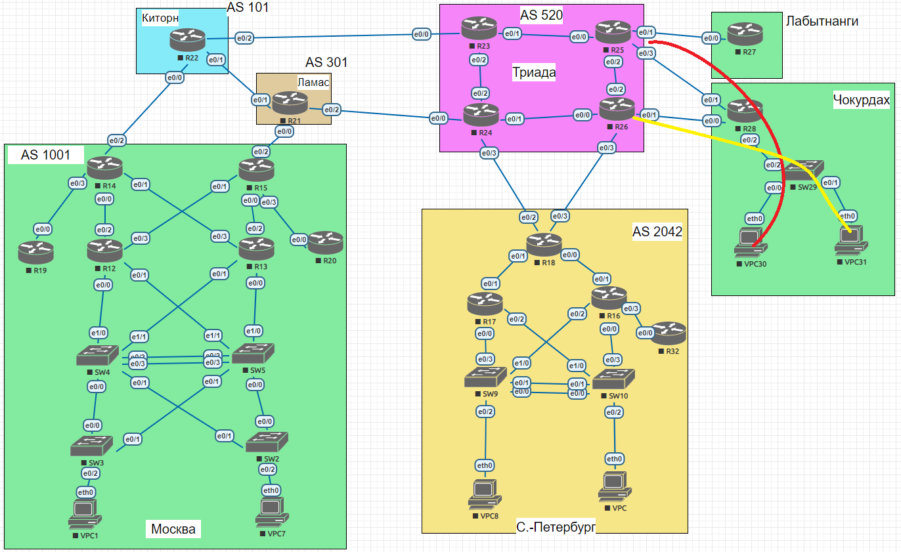

## Задание:

Настроить политику маршрутизации в офисе Чокурдах
 
Распределить трафик между 2 линками

##  Решение:

- [Конфигурационные файлы;](configs/)
- [Сохраненная топология из EVE-NG;](eve-ng_lab_PBR.zip)

### Графическая схема

### Адресное пространство:

| Автономка           | IPv4 подсети                                     | IPv6 подсети           |
|---------------------|--------------------------------------------------|------------------------|
| AS520 (Триада)      | 5.20.0.0/16                                      | 2001:DB8:520::/48      |
| AS101 (Киторн)      | 101.0.0.0/16                                     | 2001:DB8:101::/48      |
| AS301 (Ламас)       | 30.1.0.0/16                                      | 2001:DB8:301::/48      |
| AS1001 Москва       | 100.1.0.0/16                                     | 2001:DB8:1001::/48     |
| AS1001 Чокурдах     | 100.1.1.0/24 100.1.10.16/28 100.1.20.16/28 | 2001:DB8:1001:A00::/56 |
| AS1001 Лабытнанги   | 100.1.2.0/24                                     | 2001:DB8:1001:B00::/56 |
| AS2042 С.-Петербург | 20.42.0.0/16                                     | 2001:DB8:2042::/48     |

### IP интерфейсы:

AS520 (Триада)

| Device | Interface                           | IPv4 Address                                                                   | IPv6 Address                                                                                                     |
|--------|-------------------------------------|--------------------------------------------------------------------------------|------------------------------------------------------------------------------------------------------------------|
| **R23**| Lo1 e0/0 e0/1 e0/2         | 5.20.0.23/32 5.20.23.0/31 172.16.1.0/31 172.16.1.2/31                 | 2001:DB8:520::23/128 FE80::23 link-local FE80::23 link-local FE80::23 link-local                        |
| **R24**| Lo1 e0/0 e0/1 e0/2 e0/3 | 5.20.0.24/32 5.20.24.0/31 172.16.1.4/31 172.16.1.3/31 5.20.24.2/31 | 2001:DB8:520::24/128 FE80::24 link-local FE80::24 link-local FE80::24 link-local FE80::24 link-local |
| **R25**| Lo1 e0/0 e0/1 e0/2 e0/3 | 5.20.0.25/32 172.16.1.1/31 5.20.25.0/31 172.16.1.6/31 5.20.25.2/31 | 2001:DB8:520::25/128 FE80::25 link-local FE80::25 link-local FE80::25 link-local FE80::25 link-local |
| **R26**| Lo1 e0/0 e0/1 e0/2 e0/3 | 5.20.0.26/32 172.16.1.5/31 5.20.26.0/31 172.16.1.7/31 5.20.26.2/31 | 2001:DB8:520::26/128 FE80::26 link-local FE80::26 link-local FE80::26 link-local FE80::26 link-local |

AS1001 Чокурдах

| Device  | Interface                       | IPv4 Address                                                    | IPv6 Address                                                                                       |
|---------|---------------------------------|-----------------------------------------------------------------|----------------------------------------------------------------------------------------------------|
|**VPC30**| eth0                            | 100.1.10.18/28 gw 100.1.10.17                                   | 2001:DB8:1001:A10::/64 (SLAAC)                                                                     |
|**VPC31**| eth0                            | 100.1.20.18/28 gw 100.1.20.17                                   | 2001:DB8:1001:A20::/64 (SLAAC)                                                                     |
| **R28** | Lo1 e0/0 e0/1 e0/2     | 100.1.1.28 5.20.26.1/31 5.20.25.3/31 172.16.1.0/31     | 2001:DB8:1001:AA1::28 FE80::28 link-local FE80::28 link-local FE80::28 link-local         |
| **SW29**| Lo1 e0/2 vlan10 vlan20 | 100.1.1.29 172.16.1.1/31 100.1.10.17/28 100.1.20.17/28 | 2001:DB8:1001:AA1::29 FE80::29 link-local 2001:DB8:1001:A10::1/64 2001:DB8:1001:A20::1/64 |

AS1001 Лабытнанги

| Device  | Interface   | IPv4 Address                  | IPv6 Address                                     |
|---------|-------------|-------------------------------|--------------------------------------------------|
| **R27** | Lo1 e0/0 | 100.1.2.27/32 5.20.25.1/31 | 2001:DB8:1001:BB2::27/128 FE80::27 link-local |

### Внесение изменений в конфигурацию:

  
R28

<pre>
!
track 1 ip sla 1 reachability
!
track 2 ip sla 2 reachability
!
interface Ethernet0/2
 ip policy route-map office
!
no ip route 0.0.0.0 0.0.0.0 5.20.26.0
no ip route 0.0.0.0 0.0.0.0 5.20.25.2 2
ip route 0.0.0.0 0.0.0.0 5.20.26.0 track 1
ip route 0.0.0.0 0.0.0.0 5.20.25.2 2 track 2
!
ip access-list standard VPC30
 permit 100.1.10.16 0.0.0.15
ip access-list standard VPC31
 permit 100.1.20.16 0.0.0.15
!
ip sla 1
 icmp-echo 5.20.26.0 source-ip 5.20.26.1
 threshold 2
 timeout 2
 frequency 4
ip sla schedule 1 start-time now
ip sla 2
 icmp-echo 5.20.25.2 source-ip 5.20.25.3
 threshold 2
 timeout 2
 frequency 4
ip sla schedule 2 start-time now
!
route-map office permit 10
 match ip address VPC30
 set ip next-hop verify-availability 5.20.25.2 10 track 2
!
route-map office permit 20
 match ip address VPC31
!
route-map office deny 50
!
</pre>

  
R27

<pre>
!
ip route 0.0.0.0 0.0.0.0 5.20.25.0
!
ipv6 route ::/0 Ethernet0/0 FE80::25
!
</pre>

