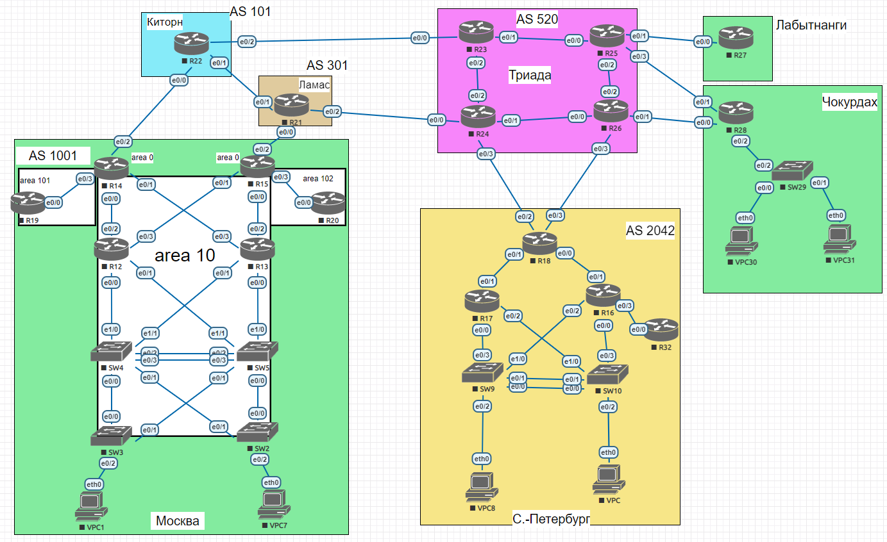

## Задание:

Настроить OSPF офисе Москва
 
Разделить сеть на зоны
 
Настроить фильтрацию между зонами

##  Решение:

- [Конфигурационные файлы;](configs/)
- [Сохраненная топология из EVE-NG;](eve-ng_lab_PBR.zip)

### Графическая схема

### Адресное пространство:

| Автономка           | IPv4 подсети                                     | IPv6 подсети           |
|---------------------|--------------------------------------------------|------------------------|
| AS520 (Триада)      | 5.20.0.0/16                                      | 2001:DB8:520::/48      |
| AS101 (Киторн)      | 101.0.0.0/16                                     | 2001:DB8:101::/48      |
| AS301 (Ламас)       | 30.1.0.0/16                                      | 2001:DB8:301::/48      |
| AS1001 Москва       | 100.1.0.0/16                                     | 2001:DB8:1001::/48     |
| AS1001 Чокурдах     | 100.1.1.0/24 100.1.10.16/28 100.1.20.16/28 | 2001:DB8:1001:A00::/56 |
| AS1001 Лабытнанги   | 100.1.2.0/24                                     | 2001:DB8:1001:B00::/56 |
| AS2042 С.-Петербург | 20.42.0.0/16                                     | 2001:DB8:2042::/48     |

### IP интерфейсы:

AS1001 Москва

| Device | Interface                                      | IPv4 Address                                                                                           | IPv6 Address                                                                                                                       |
|--------|------------------------------------------------|--------------------------------------------------------------------------------------------------------|------------------------------------------------------------------------------------------------------------------------------------|
|**VPC1**| eth0                                           | 100.1.10.2/28 gw 100.1.10.1                                                                            | 2001:DB8:1001:10::/64 (SLAAC)                                                                                                      |
|**VPC7**| eth0                                           | 100.1.20.2/28 gw 100.1.20.1                                                                            | 2001:DB8:1001:20::/64 (SLAAC)                                                                                                      |
| **SW2**| Lo1 e0/0 e0/1 vlan20                  | 100.1.0.2/32 172.16.1.27/31 172.16.1.23/31 100.1.20.1/28                                      | 2001:DB8:1001::2/128 FE80::2 link-local FE80::2 link-local 2001:DB8:1001:20::1/64                                         |
| **SW3**| Lo1 e0/0 e0/1 vlan10                  | 100.1.0.3/32 172.16.1.21/31 172.16.1.29/31 100.1.10.1/28                                      | 2001:DB8:1001::3/128 FE80::3 link-local FE80::3 link-local 2001:DB8:1001:10::1/64                                         |
| **SW4**| Lo1 e0/0 e0/1 e1/0 e1/1 vlan201 | 100.1.0.4/32 172.16.1.20/31 172.16.1.22/31 172.16.1.13/31 172.16.1.19/31 172.16.1.24/31 | 2001:DB8:1001::4/128 FE80::4 link-local FE80::4 link-local FE80::4 link-local FE80::4 link-local FE80::4 link-local |
| **SW5**| Lo1 e0/0 e0/1 e1/0 e1/1 vlan201 | 100.1.0.5/32 172.16.1.26/31 172.16.1.28/31 172.16.1.17/31 172.16.1.15/31 172.16.1.25/31 | 2001:DB8:1001::5/128 FE80::5 link-local FE80::5 link-local FE80::5 link-local FE80::5 link-local FE80::5 link-local |
| **R12**| Lo1 e0/0 e0/1 e0/2 e0/3            | 100.1.0.12/32 172.16.1.12/31 172.16.1.14/31 172.16.1.1/31 172.16.1.9/31                    | 2001:DB8:1001::12/128 FE80::12 link-local FE80::12 link-local FE80::12 link-local FE80::12 link-local                  |
| **R13**| Lo1 e0/0 e0/1 e0/2 e0/3            | 100.1.0.13/32 172.16.1.16/31 172.16.1.18/31 172.16.1.7/31 172.16.1.3/31                    | 2001:DB8:1001::13/128 FE80::13 link-local FE80::13 link-local FE80::13 link-local FE80::13 link-local                  |
| **R14**| Lo1 e0/0 e0/1 e0/2 e0/3            | 100.1.0.14/32 172.16.1.0/31 172.16.1.2/31 101.0.100.1/31 172.16.1.4/31                     | 2001:DB8:1001::14/128 FE80::14 link-local FE80::14 link-local FE80::14 link-local FE80::14 link-local                  |
| **R15**| Lo1 e0/0 e0/1 e0/2 e0/3            | 100.1.0.15/32 172.16.1.6/31 172.16.1.8/31 30.1.100.1/31 172.16.1.10/31                     | 2001:DB8:1001::15/128 FE80::15 link-local FE80::15 link-local FE80::15 link-local FE80::15 link-local                  |
| **R19**| Lo1 e0/0                                    | 100.1.0.19/32 172.16.1.5/31                                                                         | 2001:DB8:1001::19/128 FE80::19 link-local                                                                                       |
| **R20**| Lo1 e0/0                                    | 100.1.0.20/32 172.16.1.11/31                                                                        | 2001:DB8:1001::20/128 FE80::20 link-local                                                                                       |

### Внесение изменений в конфигурацию и отображение маршрутов:

  
SW2

<pre>
!
interface Loopback1
 ip ospf 1 area 10
 ipv6 ospf 1 area 10
!
interface Ethernet0/0
 ip ospf network point-to-point
 ip ospf 1 area 10
 ipv6 ospf 1 area 10
 ipv6 ospf network point-to-point
!
interface Ethernet0/1
 ip ospf network point-to-point
 ip ospf 1 area 10
 ipv6 ospf 1 area 10
 ipv6 ospf network point-to-point
!
interface Vlan20
 ip ospf 1 area 10
 ipv6 ospf 1 area 10
!
router ospf 1
 passive-interface Vlan20
!
ipv6 router ospf 1
 passive-interface Vlan20
!
no ip route *
!
no ipv6 route 2001:DB8:1001::3/128 Ethernet0/1 FE80::4
no ipv6 route 2001:DB8:1001::4/128 Ethernet0/1 FE80::4
no ipv6 route 2001:DB8:1001::12/128 Ethernet0/1 FE80::4
no ipv6 route 2001:DB8:1001::14/128 Ethernet0/1 FE80::4
no ipv6 route 2001:DB8:1001::19/128 Ethernet0/1 FE80::4
no ipv6 route 2001:DB8:1001:10::/64 Ethernet0/1 FE80::4
no ipv6 route ::/0 Ethernet0/1 FE80::4 2
no ipv6 route ::/0 Ethernet0/0 FE80::5
!
</pre>

  
SW2 show ip/ipv6 route

<pre>
SW2#sh ip route ospf | be Gateway
Gateway of last resort is 172.16.1.26 to network 0.0.0.0

O*E2  0.0.0.0/0 [110/1] via 172.16.1.26, 00:23:10, Ethernet0/0
                [110/1] via 172.16.1.22, 00:23:00, Ethernet0/1
      100.0.0.0/8 is variably subnetted, 13 subnets, 2 masks
O        100.1.0.3/32 [110/21] via 172.16.1.26, 00:23:00, Ethernet0/0
                      [110/21] via 172.16.1.22, 00:23:00, Ethernet0/1
O        100.1.0.4/32 [110/11] via 172.16.1.22, 00:23:10, Ethernet0/1
O        100.1.0.5/32 [110/11] via 172.16.1.26, 00:23:10, Ethernet0/0
O        100.1.0.12/32 [110/21] via 172.16.1.26, 00:23:10, Ethernet0/0
                       [110/21] via 172.16.1.22, 00:23:00, Ethernet0/1
O        100.1.0.13/32 [110/21] via 172.16.1.26, 00:23:10, Ethernet0/0
                       [110/21] via 172.16.1.22, 00:23:00, Ethernet0/1
O IA     100.1.0.14/32 [110/31] via 172.16.1.26, 00:23:00, Ethernet0/0
                       [110/31] via 172.16.1.22, 00:23:00, Ethernet0/1
O IA     100.1.0.15/32 [110/31] via 172.16.1.26, 00:23:00, Ethernet0/0
                       [110/31] via 172.16.1.22, 00:23:00, Ethernet0/1
O IA     100.1.0.19/32 [110/41] via 172.16.1.26, 00:23:00, Ethernet0/0
                       [110/41] via 172.16.1.22, 00:23:00, Ethernet0/1
O IA     100.1.0.20/32 [110/41] via 172.16.1.26, 00:23:00, Ethernet0/0
                       [110/41] via 172.16.1.22, 00:23:00, Ethernet0/1
O        100.1.10.0/28 [110/21] via 172.16.1.26, 00:22:49, Ethernet0/0
                       [110/21] via 172.16.1.22, 00:22:49, Ethernet0/1
      172.16.0.0/16 is variably subnetted, 17 subnets, 2 masks
O        172.16.1.0/31 [110/30] via 172.16.1.26, 00:23:10, Ethernet0/0
                       [110/30] via 172.16.1.22, 00:23:00, Ethernet0/1
O        172.16.1.2/31 [110/30] via 172.16.1.26, 00:23:10, Ethernet0/0
                       [110/30] via 172.16.1.22, 00:23:00, Ethernet0/1
O IA     172.16.1.4/31 [110/40] via 172.16.1.26, 00:23:10, Ethernet0/0
                       [110/40] via 172.16.1.22, 00:23:00, Ethernet0/1
O        172.16.1.6/31 [110/30] via 172.16.1.26, 00:23:10, Ethernet0/0
                       [110/30] via 172.16.1.22, 00:23:00, Ethernet0/1
O        172.16.1.8/31 [110/30] via 172.16.1.26, 00:23:10, Ethernet0/0
                       [110/30] via 172.16.1.22, 00:23:00, Ethernet0/1
O IA     172.16.1.10/31 [110/40] via 172.16.1.26, 00:23:10, Ethernet0/0
                        [110/40] via 172.16.1.22, 00:23:00, Ethernet0/1
O        172.16.1.12/31 [110/20] via 172.16.1.22, 00:23:10, Ethernet0/1
O        172.16.1.14/31 [110/20] via 172.16.1.26, 00:23:10, Ethernet0/0
O        172.16.1.16/31 [110/20] via 172.16.1.26, 00:23:10, Ethernet0/0
O        172.16.1.18/31 [110/20] via 172.16.1.22, 00:23:10, Ethernet0/1
O        172.16.1.20/31 [110/20] via 172.16.1.22, 00:23:10, Ethernet0/1
O        172.16.1.24/31 [110/11] via 172.16.1.26, 00:22:39, Ethernet0/0
                        [110/11] via 172.16.1.22, 00:22:39, Ethernet0/1
O        172.16.1.28/31 [110/20] via 172.16.1.26, 00:23:10, Ethernet0/0
SW2#sh ipv6 route ospf
...
OE2 ::/0 [110/1], tag 1
     via FE80::5, Ethernet0/0
     via FE80::4, Ethernet0/1
O   2001:DB8:1001::3/128 [110/20]
     via FE80::5, Ethernet0/0
     via FE80::4, Ethernet0/1
O   2001:DB8:1001::4/128 [110/10]
     via FE80::4, Ethernet0/1
O   2001:DB8:1001::5/128 [110/10]
     via FE80::5, Ethernet0/0
O   2001:DB8:1001::12/128 [110/20]
     via FE80::5, Ethernet0/0
     via FE80::4, Ethernet0/1
O   2001:DB8:1001::13/128 [110/20]
     via FE80::5, Ethernet0/0
     via FE80::4, Ethernet0/1
OI  2001:DB8:1001::14/128 [110/30]
     via FE80::5, Ethernet0/0
     via FE80::4, Ethernet0/1
OI  2001:DB8:1001::15/128 [110/30]
     via FE80::5, Ethernet0/0
     via FE80::4, Ethernet0/1
OI  2001:DB8:1001::19/128 [110/40]
     via FE80::5, Ethernet0/0
     via FE80::4, Ethernet0/1
OI  2001:DB8:1001::20/128 [110/40]
     via FE80::5, Ethernet0/0
     via FE80::4, Ethernet0/1
O   2001:DB8:1001:10::/64 [110/21]
     via FE80::5, Ethernet0/0
     via FE80::4, Ethernet0/1
</pre>

  
SW3

<pre>
!
interface Loopback1
 ip ospf 1 area 10
 ipv6 ospf 1 area 10
!
interface Ethernet0/0
 ip ospf network point-to-point
 ip ospf 1 area 10
 ipv6 ospf 1 area 10
 ipv6 ospf network point-to-point
!
interface Ethernet0/1
 ip ospf network point-to-point
 ip ospf 1 area 10
 ipv6 ospf 1 area 10
 ipv6 ospf network point-to-point
!
interface Vlan20
 ip ospf 1 area 10
 ipv6 ospf 1 area 10
!
router ospf 1
 passive-interface Vlan10
!
ipv6 router ospf 1
 passive-interface Vlan10
!
no ip route *
!
no ipv6 route 2001:DB8:1001::2/128 Ethernet0/1 FE80::5
no ipv6 route 2001:DB8:1001::5/128 Ethernet0/1 FE80::5
no ipv6 route 2001:DB8:1001::13/128 Ethernet0/1 FE80::5
no ipv6 route 2001:DB8:1001::15/128 Ethernet0/1 FE80::5
no ipv6 route 2001:DB8:1001::20/128 Ethernet0/1 FE80::5
no ipv6 route 2001:DB8:1001:20::/64 Ethernet0/1 FE80::5
no ipv6 route ::/0 Ethernet0/0 FE80::4
no ipv6 route ::/0 Ethernet0/1 FE80::5 2
!
</pre>

  
SW3 show ip/ipv6 route

<pre>
SW3#sh ip route ospf | be Gateway
Gateway of last resort is 172.16.1.28 to network 0.0.0.0

O*E2  0.0.0.0/0 [110/1] via 172.16.1.28, 00:28:00, Ethernet0/1
                [110/1] via 172.16.1.20, 00:28:00, Ethernet0/0
      100.0.0.0/8 is variably subnetted, 13 subnets, 2 masks
O        100.1.0.2/32 [110/21] via 172.16.1.28, 00:28:00, Ethernet0/1
                      [110/21] via 172.16.1.20, 00:28:10, Ethernet0/0
O        100.1.0.4/32 [110/11] via 172.16.1.20, 00:28:10, Ethernet0/0
O        100.1.0.5/32 [110/11] via 172.16.1.28, 00:28:00, Ethernet0/1
O        100.1.0.12/32 [110/21] via 172.16.1.28, 00:28:00, Ethernet0/1
                       [110/21] via 172.16.1.20, 00:28:00, Ethernet0/0
O        100.1.0.13/32 [110/21] via 172.16.1.28, 00:28:00, Ethernet0/1
                       [110/21] via 172.16.1.20, 00:28:00, Ethernet0/0
O IA     100.1.0.14/32 [110/31] via 172.16.1.28, 00:28:00, Ethernet0/1
                       [110/31] via 172.16.1.20, 00:28:00, Ethernet0/0
O IA     100.1.0.15/32 [110/31] via 172.16.1.28, 00:28:00, Ethernet0/1
                       [110/31] via 172.16.1.20, 00:28:00, Ethernet0/0
O IA     100.1.0.19/32 [110/41] via 172.16.1.28, 00:28:00, Ethernet0/1
                       [110/41] via 172.16.1.20, 00:28:00, Ethernet0/0
O IA     100.1.0.20/32 [110/41] via 172.16.1.28, 00:28:00, Ethernet0/1
                       [110/41] via 172.16.1.20, 00:28:00, Ethernet0/0
O        100.1.20.0/28 [110/21] via 172.16.1.28, 00:27:48, Ethernet0/1
                       [110/21] via 172.16.1.20, 00:27:48, Ethernet0/0
      172.16.0.0/16 is variably subnetted, 17 subnets, 2 masks
O        172.16.1.0/31 [110/30] via 172.16.1.28, 00:28:00, Ethernet0/1
                       [110/30] via 172.16.1.20, 00:28:00, Ethernet0/0
O        172.16.1.2/31 [110/30] via 172.16.1.28, 00:28:00, Ethernet0/1
                       [110/30] via 172.16.1.20, 00:28:00, Ethernet0/0
O IA     172.16.1.4/31 [110/40] via 172.16.1.28, 00:28:00, Ethernet0/1
                       [110/40] via 172.16.1.20, 00:28:00, Ethernet0/0
O        172.16.1.6/31 [110/30] via 172.16.1.28, 00:28:00, Ethernet0/1
                       [110/30] via 172.16.1.20, 00:28:00, Ethernet0/0
O        172.16.1.8/31 [110/30] via 172.16.1.28, 00:28:00, Ethernet0/1
                       [110/30] via 172.16.1.20, 00:28:00, Ethernet0/0
O IA     172.16.1.10/31 [110/40] via 172.16.1.28, 00:28:00, Ethernet0/1
                        [110/40] via 172.16.1.20, 00:28:00, Ethernet0/0
O        172.16.1.12/31 [110/20] via 172.16.1.20, 00:28:10, Ethernet0/0
O        172.16.1.14/31 [110/20] via 172.16.1.28, 00:28:00, Ethernet0/1
O        172.16.1.16/31 [110/20] via 172.16.1.28, 00:28:00, Ethernet0/1
O        172.16.1.18/31 [110/20] via 172.16.1.20, 00:28:10, Ethernet0/0
O        172.16.1.22/31 [110/20] via 172.16.1.20, 00:28:10, Ethernet0/0
O        172.16.1.24/31 [110/11] via 172.16.1.28, 00:27:38, Ethernet0/1
                        [110/11] via 172.16.1.20, 00:27:38, Ethernet0/0
O        172.16.1.26/31 [110/20] via 172.16.1.28, 00:28:00, Ethernet0/1
SW3#sh ipv6 route ospf
...
OE2 ::/0 [110/1], tag 1
     via FE80::4, Ethernet0/0
     via FE80::5, Ethernet0/1
O   2001:DB8:1001::2/128 [110/20]
     via FE80::4, Ethernet0/0
     via FE80::5, Ethernet0/1
O   2001:DB8:1001::4/128 [110/10]
     via FE80::4, Ethernet0/0
O   2001:DB8:1001::5/128 [110/10]
     via FE80::5, Ethernet0/1
O   2001:DB8:1001::12/128 [110/20]
     via FE80::4, Ethernet0/0
     via FE80::5, Ethernet0/1
O   2001:DB8:1001::13/128 [110/20]
     via FE80::4, Ethernet0/0
     via FE80::5, Ethernet0/1
OI  2001:DB8:1001::14/128 [110/30]
     via FE80::4, Ethernet0/0
     via FE80::5, Ethernet0/1
OI  2001:DB8:1001::15/128 [110/30]
     via FE80::4, Ethernet0/0
     via FE80::5, Ethernet0/1
OI  2001:DB8:1001::19/128 [110/40]
     via FE80::4, Ethernet0/0
     via FE80::5, Ethernet0/1
OI  2001:DB8:1001::20/128 [110/40]
     via FE80::4, Ethernet0/0
     via FE80::5, Ethernet0/1
O   2001:DB8:1001:20::/64 [110/21]
     via FE80::4, Ethernet0/0
     via FE80::5, Ethernet0/1
</pre>

  
SW4

<pre>
!
interface Loopback1
 ip ospf 1 area 10
 ipv6 ospf 1 area 10
!
interface Ethernet0/0
 ip ospf network point-to-point
 ip ospf 1 area 10
 ipv6 ospf 1 area 10
 ipv6 ospf network point-to-point
!
interface Ethernet0/1
 ip ospf network point-to-point
 ip ospf 1 area 10
 ipv6 ospf 1 area 10
 ipv6 ospf network point-to-point
!
interface Ethernet1/0
 ip ospf network point-to-point
 ip ospf 1 area 10
 ipv6 ospf 1 area 10
 ipv6 ospf network point-to-point
!
interface Ethernet1/1
 ip ospf network point-to-point
 ip ospf 1 area 10
 ipv6 ospf 1 area 10
 ipv6 ospf network point-to-point
!
interface Vlan201
 ip ospf network point-to-point
 ip ospf 1 area 10
 ipv6 ospf 1 area 10
 ipv6 ospf network point-to-point
!
router ospf 1
!
ipv6 router ospf 1
!
no ip route *
!
no ipv6 route 2001:DB8:1001::2/128 Ethernet0/1 FE80::2
no ipv6 route 2001:DB8:1001::2/128 Vlan201 FE80::5 2
no ipv6 route 2001:DB8:1001::2/128 Ethernet1/1 FE80::13 3
no ipv6 route 2001:DB8:1001::2/128 Ethernet1/0 FE80::12 4
no ipv6 route 2001:DB8:1001::2/128 Ethernet0/0 FE80::3 5
no ipv6 route 2001:DB8:1001::3/128 Ethernet0/0 FE80::3
no ipv6 route 2001:DB8:1001::3/128 Vlan201 FE80::5 2
no ipv6 route 2001:DB8:1001::3/128 Ethernet1/1 FE80::13 3
no ipv6 route 2001:DB8:1001::3/128 Ethernet1/0 FE80::12 4
no ipv6 route 2001:DB8:1001::3/128 Ethernet0/1 FE80::2 5
no ipv6 route 2001:DB8:1001::5/128 Vlan201 FE80::5
no ipv6 route 2001:DB8:1001::5/128 Ethernet1/1 FE80::13 2
no ipv6 route 2001:DB8:1001::5/128 Ethernet0/1 FE80::2 3
no ipv6 route 2001:DB8:1001::5/128 Ethernet1/0 FE80::12 4
no ipv6 route 2001:DB8:1001::5/128 Ethernet0/0 FE80::3 5
no ipv6 route 2001:DB8:1001::12/128 Ethernet1/0 FE80::12
no ipv6 route 2001:DB8:1001::12/128 Vlan201 FE80::5 2
no ipv6 route 2001:DB8:1001::12/128 Ethernet1/1 FE80::13 3
no ipv6 route 2001:DB8:1001::12/128 Ethernet0/1 FE80::2 4
no ipv6 route 2001:DB8:1001::12/128 Ethernet0/0 FE80::3 5
no ipv6 route 2001:DB8:1001::13/128 Ethernet1/1 FE80::13
no ipv6 route 2001:DB8:1001::13/128 Vlan201 FE80::5 2
no ipv6 route 2001:DB8:1001::13/128 Ethernet0/1 FE80::2 3
no ipv6 route 2001:DB8:1001::13/128 Ethernet1/0 FE80::12 4
no ipv6 route 2001:DB8:1001::13/128 Ethernet0/0 FE80::3 5
no ipv6 route 2001:DB8:1001::15/128 Ethernet1/1 FE80::13
no ipv6 route 2001:DB8:1001::15/128 Vlan201 FE80::5 2
no ipv6 route 2001:DB8:1001::15/128 Ethernet1/0 FE80::12 3
no ipv6 route 2001:DB8:1001::15/128 Ethernet0/1 FE80::2 4
no ipv6 route 2001:DB8:1001::15/128 Ethernet0/0 FE80::3 5
no ipv6 route 2001:DB8:1001::20/128 Ethernet1/1 FE80::13
no ipv6 route 2001:DB8:1001::20/128 Vlan201 FE80::5 2
no ipv6 route 2001:DB8:1001::20/128 Ethernet1/0 FE80::12 3
no ipv6 route 2001:DB8:1001::20/128 Ethernet0/1 FE80::2 4
no ipv6 route 2001:DB8:1001::20/128 Ethernet0/0 FE80::3 5
no ipv6 route 2001:DB8:1001:10::/64 Ethernet0/0 FE80::3
no ipv6 route 2001:DB8:1001:10::/64 Vlan201 FE80::5 2
no ipv6 route 2001:DB8:1001:10::/64 Ethernet1/1 FE80::13 3
no ipv6 route 2001:DB8:1001:10::/64 Ethernet1/0 FE80::12 4
no ipv6 route 2001:DB8:1001:10::/64 Ethernet0/1 FE80::2 5
no ipv6 route 2001:DB8:1001:20::/64 Ethernet0/1 FE80::2
no ipv6 route 2001:DB8:1001:20::/64 Vlan201 FE80::5 2
no ipv6 route 2001:DB8:1001:20::/64 Ethernet1/1 FE80::13 3
no ipv6 route 2001:DB8:1001:20::/64 Ethernet1/0 FE80::12 4
no ipv6 route 2001:DB8:1001:20::/64 Ethernet0/0 FE80::3 5
no ipv6 route ::/0 Ethernet1/0 FE80::12
no ipv6 route ::/0 Ethernet1/1 FE80::13 2
no ipv6 route ::/0 Vlan201 FE80::5 3
no ipv6 route ::/0 Ethernet0/1 FE80::2 4
no ipv6 route ::/0 Ethernet0/0 FE80::3 5
!
</pre>

  
SW4 show ip/ipv6 route

<pre>
SW4#sh ip route ospf | be Gateway
Gateway of last resort is 172.16.1.18 to network 0.0.0.0

O*E2  0.0.0.0/0 [110/1] via 172.16.1.18, 00:28:45, Ethernet1/1
                [110/1] via 172.16.1.12, 00:28:45, Ethernet1/0
      100.0.0.0/8 is variably subnetted, 12 subnets, 2 masks
O        100.1.0.2/32 [110/11] via 172.16.1.23, 00:28:55, Ethernet0/1
O        100.1.0.3/32 [110/11] via 172.16.1.21, 00:28:55, Ethernet0/0
O        100.1.0.5/32 [110/2] via 172.16.1.25, 00:28:13, Vlan201
O        100.1.0.12/32 [110/11] via 172.16.1.12, 00:28:45, Ethernet1/0
O        100.1.0.13/32 [110/11] via 172.16.1.18, 00:28:45, Ethernet1/1
O IA     100.1.0.14/32 [110/21] via 172.16.1.18, 00:28:45, Ethernet1/1
                       [110/21] via 172.16.1.12, 00:28:45, Ethernet1/0
O IA     100.1.0.15/32 [110/21] via 172.16.1.18, 00:28:45, Ethernet1/1
                       [110/21] via 172.16.1.12, 00:28:45, Ethernet1/0
O IA     100.1.0.19/32 [110/31] via 172.16.1.18, 00:28:45, Ethernet1/1
                       [110/31] via 172.16.1.12, 00:28:45, Ethernet1/0
O IA     100.1.0.20/32 [110/31] via 172.16.1.18, 00:28:45, Ethernet1/1
                       [110/31] via 172.16.1.12, 00:28:45, Ethernet1/0
O        100.1.10.0/28 [110/11] via 172.16.1.21, 00:28:33, Ethernet0/0
O        100.1.20.0/28 [110/11] via 172.16.1.23, 00:28:33, Ethernet0/1
      172.16.0.0/16 is variably subnetted, 20 subnets, 2 masks
O        172.16.1.0/31 [110/20] via 172.16.1.12, 00:28:45, Ethernet1/0
O        172.16.1.2/31 [110/20] via 172.16.1.18, 00:28:45, Ethernet1/1
O IA     172.16.1.4/31 [110/30] via 172.16.1.18, 00:28:45, Ethernet1/1
                       [110/30] via 172.16.1.12, 00:28:45, Ethernet1/0
O        172.16.1.6/31 [110/20] via 172.16.1.18, 00:28:45, Ethernet1/1
O        172.16.1.8/31 [110/20] via 172.16.1.12, 00:28:45, Ethernet1/0
O IA     172.16.1.10/31 [110/30] via 172.16.1.18, 00:28:45, Ethernet1/1
                        [110/30] via 172.16.1.12, 00:28:45, Ethernet1/0
O        172.16.1.14/31 [110/11] via 172.16.1.25, 00:28:13, Vlan201
O        172.16.1.16/31 [110/11] via 172.16.1.25, 00:28:13, Vlan201
O        172.16.1.26/31 [110/11] via 172.16.1.25, 00:28:13, Vlan201
O        172.16.1.28/31 [110/11] via 172.16.1.25, 00:28:13, Vlan201
SW4#sh ipv6 route ospf
...
OE2 ::/0 [110/1], tag 1
     via FE80::12, Ethernet1/0
     via FE80::13, Ethernet1/1
O   2001:DB8:1001::2/128 [110/10]
     via FE80::2, Ethernet0/1
O   2001:DB8:1001::3/128 [110/10]
     via FE80::3, Ethernet0/0
O   2001:DB8:1001::5/128 [110/1]
     via FE80::5, Vlan201
O   2001:DB8:1001::12/128 [110/10]
     via FE80::12, Ethernet1/0
O   2001:DB8:1001::13/128 [110/10]
     via FE80::13, Ethernet1/1
OI  2001:DB8:1001::14/128 [110/20]
     via FE80::12, Ethernet1/0
     via FE80::13, Ethernet1/1
OI  2001:DB8:1001::15/128 [110/20]
     via FE80::12, Ethernet1/0
     via FE80::13, Ethernet1/1
OI  2001:DB8:1001::19/128 [110/30]
     via FE80::12, Ethernet1/0
     via FE80::13, Ethernet1/1
OI  2001:DB8:1001::20/128 [110/30]
     via FE80::12, Ethernet1/0
     via FE80::13, Ethernet1/1
O   2001:DB8:1001:10::/64 [110/11]
     via FE80::3, Ethernet0/0
O   2001:DB8:1001:20::/64 [110/11]
     via FE80::2, Ethernet0/1
</pre>

  
SW5

<pre>
!
interface Loopback1
 ip ospf 1 area 10
 ipv6 ospf 1 area 10
!
interface Ethernet0/0
 ip ospf network point-to-point
 ip ospf 1 area 10
 ipv6 ospf 1 area 10
 ipv6 ospf network point-to-point
!
interface Ethernet0/1
 ip ospf network point-to-point
 ip ospf 1 area 10
 ipv6 ospf 1 area 10
 ipv6 ospf network point-to-point
!
interface Ethernet1/0
 ip ospf network point-to-point
 ip ospf 1 area 10
 ipv6 ospf 1 area 10
 ipv6 ospf network point-to-point
!
interface Ethernet1/1
 ip ospf network point-to-point
 ip ospf 1 area 10
 ipv6 ospf 1 area 10
 ipv6 ospf network point-to-point
!
interface Vlan201
 ip ospf network point-to-point
 ip ospf 1 area 10
 ipv6 ospf 1 area 10
 ipv6 ospf network point-to-point
!
router ospf 1
!
ipv6 router ospf 1
!
no ip route *
!
no ipv6 route 2001:DB8:1001::2/128 Ethernet0/0 FE80::2
no ipv6 route 2001:DB8:1001::2/128 Vlan201 FE80::4 2
no ipv6 route 2001:DB8:1001::2/128 Ethernet1/1 FE80::12 3
no ipv6 route 2001:DB8:1001::2/128 Ethernet1/0 FE80::13 4
no ipv6 route 2001:DB8:1001::2/128 Ethernet0/1 FE80::3 5
no ipv6 route 2001:DB8:1001::3/128 Ethernet0/1 FE80::3
no ipv6 route 2001:DB8:1001::3/128 Vlan201 FE80::4 2
no ipv6 route 2001:DB8:1001::3/128 Ethernet1/1 FE80::12 3
no ipv6 route 2001:DB8:1001::3/128 Ethernet1/0 FE80::13 4
no ipv6 route 2001:DB8:1001::3/128 Ethernet0/0 FE80::2 5
no ipv6 route 2001:DB8:1001::4/128 Vlan201 FE80::4
no ipv6 route 2001:DB8:1001::4/128 Ethernet1/1 FE80::12 2
no ipv6 route 2001:DB8:1001::4/128 Ethernet0/1 FE80::3 3
no ipv6 route 2001:DB8:1001::4/128 Ethernet1/0 FE80::13 4
no ipv6 route 2001:DB8:1001::4/128 Ethernet0/0 FE80::2 5
no ipv6 route 2001:DB8:1001::12/128 Ethernet1/1 FE80::12
no ipv6 route 2001:DB8:1001::12/128 Vlan201 FE80::4 2
no ipv6 route 2001:DB8:1001::12/128 Ethernet0/1 FE80::3 3
no ipv6 route 2001:DB8:1001::12/128 Ethernet1/0 FE80::13 4
no ipv6 route 2001:DB8:1001::12/128 Ethernet0/0 FE80::2 5
no ipv6 route 2001:DB8:1001::13/128 Ethernet1/0 FE80::13
no ipv6 route 2001:DB8:1001::13/128 Vlan201 FE80::4 2
no ipv6 route 2001:DB8:1001::13/128 Ethernet1/1 FE80::12 3
no ipv6 route 2001:DB8:1001::13/128 Ethernet0/1 FE80::3 4
no ipv6 route 2001:DB8:1001::13/128 Ethernet0/0 FE80::2 5
no ipv6 route 2001:DB8:1001::14/128 Ethernet1/1 FE80::12
no ipv6 route 2001:DB8:1001::14/128 Vlan201 FE80::4 2
no ipv6 route 2001:DB8:1001::14/128 Ethernet1/0 FE80::13 3
no ipv6 route 2001:DB8:1001::14/128 Ethernet0/1 FE80::3 4
no ipv6 route 2001:DB8:1001::14/128 Ethernet0/0 FE80::2 5
no ipv6 route 2001:DB8:1001::19/128 Ethernet1/1 FE80::12
no ipv6 route 2001:DB8:1001::19/128 Vlan201 FE80::4 2
no ipv6 route 2001:DB8:1001::19/128 Ethernet1/0 FE80::13 3
no ipv6 route 2001:DB8:1001::19/128 Ethernet0/1 FE80::3 4
no ipv6 route 2001:DB8:1001::19/128 Ethernet0/0 FE80::2 5
no ipv6 route 2001:DB8:1001:10::/64 Ethernet0/1 FE80::3
no ipv6 route 2001:DB8:1001:10::/64 Vlan201 FE80::4 2
no ipv6 route 2001:DB8:1001:10::/64 Ethernet1/1 FE80::12 3
no ipv6 route 2001:DB8:1001:10::/64 Ethernet1/0 FE80::13 4
no ipv6 route 2001:DB8:1001:10::/64 Ethernet0/0 FE80::2 5
no ipv6 route 2001:DB8:1001:20::/64 Ethernet0/0 FE80::2
no ipv6 route 2001:DB8:1001:20::/64 Vlan201 FE80::4 2
no ipv6 route 2001:DB8:1001:20::/64 Ethernet1/1 FE80::12 3
no ipv6 route 2001:DB8:1001:20::/64 Ethernet1/0 FE80::13 4
no ipv6 route 2001:DB8:1001:20::/64 Ethernet0/1 FE80::3 5
no ipv6 route ::/0 Ethernet1/0 FE80::13
no ipv6 route ::/0 Ethernet1/1 FE80::12 2
no ipv6 route ::/0 Vlan201 FE80::4 3
no ipv6 route ::/0 Ethernet0/1 FE80::3 4
no ipv6 route ::/0 Ethernet0/0 FE80::2 5
!
</pre>

  
SW5 show ip/ipv6 route

<pre>
SW5#sh ip route ospf | be Gateway
Gateway of last resort is 172.16.1.16 to network 0.0.0.0

O*E2  0.0.0.0/0 [110/1] via 172.16.1.16, 00:30:01, Ethernet1/0
                [110/1] via 172.16.1.14, 00:30:01, Ethernet1/1
      100.0.0.0/8 is variably subnetted, 12 subnets, 2 masks
O        100.1.0.2/32 [110/11] via 172.16.1.27, 00:30:01, Ethernet0/0
O        100.1.0.3/32 [110/11] via 172.16.1.29, 00:29:51, Ethernet0/1
O        100.1.0.4/32 [110/2] via 172.16.1.24, 00:29:19, Vlan201
O        100.1.0.12/32 [110/11] via 172.16.1.14, 00:30:01, Ethernet1/1
O        100.1.0.13/32 [110/11] via 172.16.1.16, 00:30:01, Ethernet1/0
O IA     100.1.0.14/32 [110/21] via 172.16.1.16, 00:29:51, Ethernet1/0
                       [110/21] via 172.16.1.14, 00:29:51, Ethernet1/1
O IA     100.1.0.15/32 [110/21] via 172.16.1.16, 00:29:51, Ethernet1/0
                       [110/21] via 172.16.1.14, 00:29:51, Ethernet1/1
O IA     100.1.0.19/32 [110/31] via 172.16.1.16, 00:29:51, Ethernet1/0
                       [110/31] via 172.16.1.14, 00:29:51, Ethernet1/1
O IA     100.1.0.20/32 [110/31] via 172.16.1.16, 00:29:51, Ethernet1/0
                       [110/31] via 172.16.1.14, 00:29:51, Ethernet1/1
O        100.1.10.0/28 [110/11] via 172.16.1.29, 00:29:39, Ethernet0/1
O        100.1.20.0/28 [110/11] via 172.16.1.27, 00:29:39, Ethernet0/0
      172.16.0.0/16 is variably subnetted, 20 subnets, 2 masks
O        172.16.1.0/31 [110/20] via 172.16.1.14, 00:30:01, Ethernet1/1
O        172.16.1.2/31 [110/20] via 172.16.1.16, 00:30:01, Ethernet1/0
O IA     172.16.1.4/31 [110/30] via 172.16.1.16, 00:30:01, Ethernet1/0
                       [110/30] via 172.16.1.14, 00:30:01, Ethernet1/1
O        172.16.1.6/31 [110/20] via 172.16.1.16, 00:30:01, Ethernet1/0
O        172.16.1.8/31 [110/20] via 172.16.1.14, 00:30:01, Ethernet1/1
O IA     172.16.1.10/31 [110/30] via 172.16.1.16, 00:30:01, Ethernet1/0
                        [110/30] via 172.16.1.14, 00:30:01, Ethernet1/1
O        172.16.1.12/31 [110/11] via 172.16.1.24, 00:29:19, Vlan201
O        172.16.1.18/31 [110/11] via 172.16.1.24, 00:29:19, Vlan201
O        172.16.1.20/31 [110/11] via 172.16.1.24, 00:29:19, Vlan201
O        172.16.1.22/31 [110/11] via 172.16.1.24, 00:29:19, Vlan201
SW5#sh ipv6 route ospf
...
OE2 ::/0 [110/1], tag 1
     via FE80::13, Ethernet1/0
     via FE80::12, Ethernet1/1
O   2001:DB8:1001::2/128 [110/10]
     via FE80::2, Ethernet0/0
O   2001:DB8:1001::3/128 [110/10]
     via FE80::3, Ethernet0/1
O   2001:DB8:1001::4/128 [110/1]
     via FE80::4, Vlan201
O   2001:DB8:1001::12/128 [110/10]
     via FE80::12, Ethernet1/1
O   2001:DB8:1001::13/128 [110/10]
     via FE80::13, Ethernet1/0
OI  2001:DB8:1001::14/128 [110/20]
     via FE80::13, Ethernet1/0
     via FE80::12, Ethernet1/1
OI  2001:DB8:1001::15/128 [110/20]
     via FE80::13, Ethernet1/0
     via FE80::12, Ethernet1/1
OI  2001:DB8:1001::19/128 [110/30]
     via FE80::13, Ethernet1/0
     via FE80::12, Ethernet1/1
OI  2001:DB8:1001::20/128 [110/30]
     via FE80::13, Ethernet1/0
     via FE80::12, Ethernet1/1
O   2001:DB8:1001:10::/64 [110/11]
     via FE80::3, Ethernet0/1
O   2001:DB8:1001:20::/64 [110/11]
     via FE80::2, Ethernet0/0
</pre>

  
R12

<pre>
!
interface Loopback1
 ip ospf 1 area 10
 ipv6 ospf 1 area 10
!
interface Ethernet0/0
 ip ospf network point-to-point
 ip ospf 1 area 10
 ipv6 ospf 1 area 10
 ipv6 ospf network point-to-point
!
interface Ethernet0/1
 ip ospf network point-to-point
 ip ospf 1 area 10
 ipv6 ospf 1 area 10
 ipv6 ospf network point-to-point
!
interface Ethernet0/2
 ip ospf network point-to-point
 ip ospf 1 area 10
 ipv6 ospf 1 area 10
 ipv6 ospf network point-to-point
!
interface Ethernet0/3
 ip ospf network point-to-point
 ip ospf 1 area 10
 ipv6 ospf 1 area 10
 ipv6 ospf network point-to-point
!
router ospf 1
!
ipv6 router ospf 1
!
no ip route *
!
no ipv6 route 2001:DB8:1001::2/128 Ethernet0/1 FE80::5
no ipv6 route 2001:DB8:1001::2/128 Ethernet0/0 FE80::4 2
no ipv6 route 2001:DB8:1001::2/128 Ethernet0/3 FE80::15 3
no ipv6 route 2001:DB8:1001::3/128 Ethernet0/0 FE80::4
no ipv6 route 2001:DB8:1001::3/128 Ethernet0/1 FE80::5 2
no ipv6 route 2001:DB8:1001::3/128 Ethernet0/3 FE80::15 3
no ipv6 route 2001:DB8:1001::4/128 Ethernet0/0 FE80::4
no ipv6 route 2001:DB8:1001::4/128 Ethernet0/1 FE80::5 2
no ipv6 route 2001:DB8:1001::4/128 Ethernet0/3 FE80::15 3
no ipv6 route 2001:DB8:1001::5/128 Ethernet0/1 FE80::5
no ipv6 route 2001:DB8:1001::5/128 Ethernet0/0 FE80::4 2
no ipv6 route 2001:DB8:1001::5/128 Ethernet0/3 FE80::15 3
no ipv6 route 2001:DB8:1001::13/128 Ethernet0/3 FE80::15 2
no ipv6 route 2001:DB8:1001::13/128 Ethernet0/1 FE80::5 3
no ipv6 route 2001:DB8:1001::13/128 Ethernet0/0 FE80::4 4
no ipv6 route 2001:DB8:1001::15/128 Ethernet0/3 FE80::15
no ipv6 route 2001:DB8:1001::15/128 Ethernet0/2 FE80::14 2
no ipv6 route 2001:DB8:1001::15/128 Ethernet0/1 FE80::5 3
no ipv6 route 2001:DB8:1001::15/128 Ethernet0/0 FE80::4 4
no ipv6 route 2001:DB8:1001::20/128 Ethernet0/3 FE80::15
no ipv6 route 2001:DB8:1001::20/128 Ethernet0/2 FE80::14 2
no ipv6 route 2001:DB8:1001::20/128 Ethernet0/1 FE80::5 3
no ipv6 route 2001:DB8:1001::20/128 Ethernet0/0 FE80::4 4
no ipv6 route 2001:DB8:1001:10::/64 Ethernet0/0 FE80::4
no ipv6 route 2001:DB8:1001:10::/64 Ethernet0/1 FE80::5 2
no ipv6 route 2001:DB8:1001:10::/64 Ethernet0/3 FE80::15 3
no ipv6 route 2001:DB8:1001:20::/64 Ethernet0/1 FE80::5
no ipv6 route 2001:DB8:1001:20::/64 Ethernet0/0 FE80::4 2
no ipv6 route 2001:DB8:1001:20::/64 Ethernet0/3 FE80::15 3
no ipv6 route ::/0 Ethernet0/2 FE80::14
no ipv6 route ::/0 Ethernet0/3 FE80::15 2
no ipv6 route ::/0 Ethernet0/1 FE80::5 3
no ipv6 route ::/0 Ethernet0/0 FE80::4 4
!
</pre>

  
R12 show ip/ipv6 route

<pre>
R12#sh ip route ospf | be Gateway
Gateway of last resort is 172.16.1.8 to network 0.0.0.0

O*E2  0.0.0.0/0 [110/1] via 172.16.1.8, 00:31:04, Ethernet0/3
                [110/1] via 172.16.1.0, 00:31:04, Ethernet0/2
      100.0.0.0/8 is variably subnetted, 12 subnets, 2 masks
O        100.1.0.2/32 [110/21] via 172.16.1.15, 00:31:04, Ethernet0/1
                      [110/21] via 172.16.1.13, 00:31:04, Ethernet0/0
O        100.1.0.3/32 [110/21] via 172.16.1.15, 00:31:04, Ethernet0/1
                      [110/21] via 172.16.1.13, 00:31:04, Ethernet0/0
O        100.1.0.4/32 [110/11] via 172.16.1.13, 00:31:04, Ethernet0/0
O        100.1.0.5/32 [110/11] via 172.16.1.15, 00:31:04, Ethernet0/1
O        100.1.0.13/32 [110/21] via 172.16.1.15, 00:31:04, Ethernet0/1
                       [110/21] via 172.16.1.13, 00:31:04, Ethernet0/0
                       [110/21] via 172.16.1.8, 00:31:04, Ethernet0/3
                       [110/21] via 172.16.1.0, 00:31:04, Ethernet0/2
O IA     100.1.0.14/32 [110/11] via 172.16.1.0, 00:31:04, Ethernet0/2
O IA     100.1.0.15/32 [110/11] via 172.16.1.8, 00:31:04, Ethernet0/3
O IA     100.1.0.19/32 [110/21] via 172.16.1.0, 00:31:04, Ethernet0/2
O IA     100.1.0.20/32 [110/21] via 172.16.1.8, 00:31:04, Ethernet0/3
O        100.1.10.0/28 [110/21] via 172.16.1.15, 00:30:47, Ethernet0/1
                       [110/21] via 172.16.1.13, 00:30:47, Ethernet0/0
O        100.1.20.0/28 [110/21] via 172.16.1.15, 00:30:47, Ethernet0/1
                       [110/21] via 172.16.1.13, 00:30:47, Ethernet0/0
      172.16.0.0/16 is variably subnetted, 19 subnets, 2 masks
O        172.16.1.2/31 [110/20] via 172.16.1.0, 00:31:04, Ethernet0/2
O IA     172.16.1.4/31 [110/20] via 172.16.1.0, 00:31:04, Ethernet0/2
O        172.16.1.6/31 [110/20] via 172.16.1.8, 00:31:04, Ethernet0/3
O IA     172.16.1.10/31 [110/20] via 172.16.1.8, 00:31:04, Ethernet0/3
O        172.16.1.16/31 [110/20] via 172.16.1.15, 00:31:04, Ethernet0/1
O        172.16.1.18/31 [110/20] via 172.16.1.13, 00:31:04, Ethernet0/0
O        172.16.1.20/31 [110/20] via 172.16.1.13, 00:31:04, Ethernet0/0
O        172.16.1.22/31 [110/20] via 172.16.1.13, 00:31:04, Ethernet0/0
O        172.16.1.24/31 [110/11] via 172.16.1.15, 00:30:37, Ethernet0/1
                        [110/11] via 172.16.1.13, 00:30:37, Ethernet0/0
O        172.16.1.26/31 [110/20] via 172.16.1.15, 00:31:04, Ethernet0/1
O        172.16.1.28/31 [110/20] via 172.16.1.15, 00:31:04, Ethernet0/1
R12#sh ipv6 route ospf
...
OE2 ::/0 [110/1], tag 1
     via FE80::15, Ethernet0/3
     via FE80::14, Ethernet0/2
O   2001:DB8:1001::2/128 [110/20]
     via FE80::4, Ethernet0/0
     via FE80::5, Ethernet0/1
O   2001:DB8:1001::3/128 [110/20]
     via FE80::4, Ethernet0/0
     via FE80::5, Ethernet0/1
O   2001:DB8:1001::4/128 [110/10]
     via FE80::4, Ethernet0/0
O   2001:DB8:1001::5/128 [110/10]
     via FE80::5, Ethernet0/1
O   2001:DB8:1001::13/128 [110/20]
     via FE80::4, Ethernet0/0
     via FE80::15, Ethernet0/3
     via FE80::14, Ethernet0/2
     via FE80::5, Ethernet0/1
OI  2001:DB8:1001::14/128 [110/10]
     via FE80::14, Ethernet0/2
OI  2001:DB8:1001::15/128 [110/10]
     via FE80::15, Ethernet0/3
OI  2001:DB8:1001::19/128 [110/20]
     via FE80::14, Ethernet0/2
OI  2001:DB8:1001::20/128 [110/20]
     via FE80::15, Ethernet0/3
O   2001:DB8:1001:10::/64 [110/21]
     via FE80::4, Ethernet0/0
     via FE80::5, Ethernet0/1
O   2001:DB8:1001:20::/64 [110/21]
     via FE80::4, Ethernet0/0
     via FE80::5, Ethernet0/1
</pre>

  
R13

<pre>
!
interface Loopback1
 ip ospf 1 area 10
 ipv6 ospf 1 area 10
!
interface Ethernet0/0
 ip ospf network point-to-point
 ip ospf 1 area 10
 ipv6 ospf 1 area 10
 ipv6 ospf network point-to-point
!
interface Ethernet0/1
 ip ospf network point-to-point
 ip ospf 1 area 10
 ipv6 ospf 1 area 10
 ipv6 ospf network point-to-point
!
interface Ethernet0/2
 ip ospf network point-to-point
 ip ospf 1 area 10
 ipv6 ospf 1 area 10
 ipv6 ospf network point-to-point
!
interface Ethernet0/3
 ip ospf network point-to-point
 ip ospf 1 area 10
 ipv6 ospf 1 area 10
 ipv6 ospf network point-to-point
!
router ospf 1
!
ipv6 router ospf 1
!
no ip route *
!
no ipv6 route 2001:DB8:1001::2/128 Ethernet0/0 FE80::5
no ipv6 route 2001:DB8:1001::2/128 Ethernet0/1 FE80::4 2
no ipv6 route 2001:DB8:1001::2/128 Ethernet0/3 FE80::14 3
no ipv6 route 2001:DB8:1001::3/128 Ethernet0/1 FE80::4
no ipv6 route 2001:DB8:1001::3/128 Ethernet0/0 FE80::5 2
no ipv6 route 2001:DB8:1001::3/128 Ethernet0/3 FE80::14 3
no ipv6 route 2001:DB8:1001::4/128 Ethernet0/1 FE80::4
no ipv6 route 2001:DB8:1001::4/128 Ethernet0/0 FE80::5 2
no ipv6 route 2001:DB8:1001::4/128 Ethernet0/3 FE80::14 3
no ipv6 route 2001:DB8:1001::5/128 Ethernet0/0 FE80::5
no ipv6 route 2001:DB8:1001::5/128 Ethernet0/1 FE80::4 2
no ipv6 route 2001:DB8:1001::5/128 Ethernet0/3 FE80::14 3
no ipv6 route 2001:DB8:1001::12/128 Ethernet0/3 FE80::14
no ipv6 route 2001:DB8:1001::12/128 Ethernet0/2 FE80::15 2
no ipv6 route 2001:DB8:1001::12/128 Ethernet0/0 FE80::5 3
no ipv6 route 2001:DB8:1001::12/128 Ethernet0/1 FE80::4 4
no ipv6 route 2001:DB8:1001::14/128 Ethernet0/3 FE80::14
no ipv6 route 2001:DB8:1001::14/128 Ethernet0/2 FE80::15 2
no ipv6 route 2001:DB8:1001::14/128 Ethernet0/0 FE80::5 3
no ipv6 route 2001:DB8:1001::14/128 Ethernet0/1 FE80::4 4
no ipv6 route 2001:DB8:1001::19/128 Ethernet0/3 FE80::14
no ipv6 route 2001:DB8:1001::19/128 Ethernet0/2 FE80::15 2
no ipv6 route 2001:DB8:1001::19/128 Ethernet0/0 FE80::5 3
no ipv6 route 2001:DB8:1001::19/128 Ethernet0/1 FE80::4 4
no ipv6 route 2001:DB8:1001:10::/64 Ethernet0/1 FE80::4
no ipv6 route 2001:DB8:1001:10::/64 Ethernet0/0 FE80::5 2
no ipv6 route 2001:DB8:1001:10::/64 Ethernet0/3 FE80::14 3
no ipv6 route 2001:DB8:1001:20::/64 Ethernet0/0 FE80::5
no ipv6 route 2001:DB8:1001:20::/64 Ethernet0/1 FE80::4 2
no ipv6 route 2001:DB8:1001:20::/64 Ethernet0/3 FE80::14 3
no ipv6 route ::/0 Ethernet0/2 FE80::15
no ipv6 route ::/0 Ethernet0/3 FE80::14 2
no ipv6 route ::/0 Ethernet0/1 FE80::4 3
no ipv6 route ::/0 Ethernet0/0 FE80::5 4
!
</pre>

  
R13 show ip/ipv6 route

<pre>
R13#sh ip route ospf | be Gateway
Gateway of last resort is 172.16.1.6 to network 0.0.0.0

O*E2  0.0.0.0/0 [110/1] via 172.16.1.6, 00:32:02, Ethernet0/2
                [110/1] via 172.16.1.2, 00:32:02, Ethernet0/3
      100.0.0.0/8 is variably subnetted, 12 subnets, 2 masks
O        100.1.0.2/32 [110/21] via 172.16.1.19, 00:32:02, Ethernet0/1
                      [110/21] via 172.16.1.17, 00:32:02, Ethernet0/0
O        100.1.0.3/32 [110/21] via 172.16.1.19, 00:32:02, Ethernet0/1
                      [110/21] via 172.16.1.17, 00:32:02, Ethernet0/0
O        100.1.0.4/32 [110/11] via 172.16.1.19, 00:32:02, Ethernet0/1
O        100.1.0.5/32 [110/11] via 172.16.1.17, 00:32:02, Ethernet0/0
O        100.1.0.12/32 [110/21] via 172.16.1.19, 00:32:02, Ethernet0/1
                       [110/21] via 172.16.1.17, 00:32:02, Ethernet0/0
                       [110/21] via 172.16.1.6, 00:32:02, Ethernet0/2
                       [110/21] via 172.16.1.2, 00:32:02, Ethernet0/3
O IA     100.1.0.14/32 [110/11] via 172.16.1.2, 00:32:02, Ethernet0/3
O IA     100.1.0.15/32 [110/11] via 172.16.1.6, 00:32:02, Ethernet0/2
O IA     100.1.0.19/32 [110/21] via 172.16.1.2, 00:32:02, Ethernet0/3
O IA     100.1.0.20/32 [110/21] via 172.16.1.6, 00:32:02, Ethernet0/2
O        100.1.10.0/28 [110/21] via 172.16.1.19, 00:31:45, Ethernet0/1
                       [110/21] via 172.16.1.17, 00:31:45, Ethernet0/0
O        100.1.20.0/28 [110/21] via 172.16.1.19, 00:31:45, Ethernet0/1
                       [110/21] via 172.16.1.17, 00:31:45, Ethernet0/0
      172.16.0.0/16 is variably subnetted, 19 subnets, 2 masks
O        172.16.1.0/31 [110/20] via 172.16.1.2, 00:32:02, Ethernet0/3
O IA     172.16.1.4/31 [110/20] via 172.16.1.2, 00:32:02, Ethernet0/3
O        172.16.1.8/31 [110/20] via 172.16.1.6, 00:32:02, Ethernet0/2
O IA     172.16.1.10/31 [110/20] via 172.16.1.6, 00:32:02, Ethernet0/2
O        172.16.1.12/31 [110/20] via 172.16.1.19, 00:32:02, Ethernet0/1
O        172.16.1.14/31 [110/20] via 172.16.1.17, 00:32:02, Ethernet0/0
O        172.16.1.20/31 [110/20] via 172.16.1.19, 00:32:02, Ethernet0/1
O        172.16.1.22/31 [110/20] via 172.16.1.19, 00:32:02, Ethernet0/1
O        172.16.1.24/31 [110/11] via 172.16.1.19, 00:31:35, Ethernet0/1
                        [110/11] via 172.16.1.17, 00:31:35, Ethernet0/0
O        172.16.1.26/31 [110/20] via 172.16.1.17, 00:32:02, Ethernet0/0
O        172.16.1.28/31 [110/20] via 172.16.1.17, 00:32:02, Ethernet0/0
R13#sh ipv6 route ospf
...
OE2 ::/0 [110/1], tag 1
     via FE80::14, Ethernet0/3
     via FE80::15, Ethernet0/2
O   2001:DB8:1001::2/128 [110/20]
     via FE80::5, Ethernet0/0
     via FE80::4, Ethernet0/1
O   2001:DB8:1001::3/128 [110/20]
     via FE80::5, Ethernet0/0
     via FE80::4, Ethernet0/1
O   2001:DB8:1001::4/128 [110/10]
     via FE80::4, Ethernet0/1
O   2001:DB8:1001::5/128 [110/10]
     via FE80::5, Ethernet0/0
O   2001:DB8:1001::12/128 [110/20]
     via FE80::14, Ethernet0/3
     via FE80::5, Ethernet0/0
     via FE80::15, Ethernet0/2
     via FE80::4, Ethernet0/1
OI  2001:DB8:1001::14/128 [110/10]
     via FE80::14, Ethernet0/3
OI  2001:DB8:1001::15/128 [110/10]
     via FE80::15, Ethernet0/2
OI  2001:DB8:1001::19/128 [110/20]
     via FE80::14, Ethernet0/3
OI  2001:DB8:1001::20/128 [110/20]
     via FE80::15, Ethernet0/2
O   2001:DB8:1001:10::/64 [110/21]
     via FE80::5, Ethernet0/0
     via FE80::4, Ethernet0/1
O   2001:DB8:1001:20::/64 [110/21]
     via FE80::5, Ethernet0/0
     via FE80::4, Ethernet0/1
</pre>

  
R14

<pre>
!
interface Loopback1
 ip ospf 1 area 0
 ipv6 ospf 1 area 0
!
interface Ethernet0/0
 ip ospf network point-to-point
 ip ospf 1 area 10
 ipv6 ospf 1 area 10
 ipv6 ospf network point-to-point
!
interface Ethernet0/1
 ip ospf network point-to-point
 ip ospf 1 area 10
 ipv6 ospf 1 area 10
 ipv6 ospf network point-to-point
!
interface Ethernet0/3
 ip ospf network point-to-point
 ip ospf 1 area 101
 ipv6 ospf 1 area 101
 ipv6 ospf network point-to-point
!
router ospf 1
 area 101 stub no-summary
 default-information originate
!
ipv6 router ospf 1
 area 101 stub no-summary
 default-information originate
!
no ip route *
ip route 0.0.0.0 0.0.0.0 101.0.100.0
!
no ipv6 route 2001:DB8:1001::2/128 Ethernet0/1 FE80::13
no ipv6 route 2001:DB8:1001::2/128 Ethernet0/0 FE80::12 2
no ipv6 route 2001:DB8:1001::3/128 Ethernet0/0 FE80::12
no ipv6 route 2001:DB8:1001::3/128 Ethernet0/1 FE80::13 2
no ipv6 route 2001:DB8:1001::4/128 Ethernet0/0 FE80::12
no ipv6 route 2001:DB8:1001::4/128 Ethernet0/1 FE80::13 2
no ipv6 route 2001:DB8:1001::5/128 Ethernet0/1 FE80::13
no ipv6 route 2001:DB8:1001::5/128 Ethernet0/0 FE80::12 2
no ipv6 route 2001:DB8:1001::12/128 Ethernet0/0 FE80::12
no ipv6 route 2001:DB8:1001::12/128 Ethernet0/1 FE80::13 2
no ipv6 route 2001:DB8:1001::13/128 Ethernet0/1 FE80::13
no ipv6 route 2001:DB8:1001::13/128 Ethernet0/0 FE80::12 2
no ipv6 route 2001:DB8:1001::15/128 Ethernet0/1 FE80::13
no ipv6 route 2001:DB8:1001::15/128 Ethernet0/0 FE80::12 2
no ipv6 route 2001:DB8:1001::19/128 Ethernet0/3 FE80::19
no ipv6 route 2001:DB8:1001::20/128 Ethernet0/1 FE80::13
no ipv6 route 2001:DB8:1001::20/128 Ethernet0/0 FE80::12 2
no ipv6 route 2001:DB8:1001:10::/64 Ethernet0/0 FE80::12
no ipv6 route 2001:DB8:1001:10::/64 Ethernet0/1 FE80::13 2
no ipv6 route 2001:DB8:1001:20::/64 Ethernet0/1 FE80::13
no ipv6 route 2001:DB8:1001:20::/64 Ethernet0/0 FE80::12 2
no ipv6 route ::/0 Ethernet0/1 FE80::13 2
no ipv6 route ::/0 Ethernet0/0 FE80::12 3
!
</pre>

  
R14 show ip/ipv6 route

<pre>
R14#sh ip route ospf | be Gateway
Gateway of last resort is 101.0.100.0 to network 0.0.0.0

      100.0.0.0/8 is variably subnetted, 12 subnets, 2 masks
O        100.1.0.2/32 [110/31] via 172.16.1.3, 00:32:38, Ethernet0/1
                      [110/31] via 172.16.1.1, 00:32:38, Ethernet0/0
O        100.1.0.3/32 [110/31] via 172.16.1.3, 00:32:38, Ethernet0/1
                      [110/31] via 172.16.1.1, 00:32:38, Ethernet0/0
O        100.1.0.4/32 [110/21] via 172.16.1.3, 00:32:38, Ethernet0/1
                      [110/21] via 172.16.1.1, 00:32:38, Ethernet0/0
O        100.1.0.5/32 [110/21] via 172.16.1.3, 00:32:38, Ethernet0/1
                      [110/21] via 172.16.1.1, 00:32:38, Ethernet0/0
O        100.1.0.12/32 [110/11] via 172.16.1.1, 00:32:38, Ethernet0/0
O        100.1.0.13/32 [110/11] via 172.16.1.3, 00:32:38, Ethernet0/1
O IA     100.1.0.15/32 [110/21] via 172.16.1.3, 00:32:38, Ethernet0/1
                       [110/21] via 172.16.1.1, 00:32:38, Ethernet0/0
O        100.1.0.19/32 [110/11] via 172.16.1.5, 00:32:38, Ethernet0/3
O IA     100.1.0.20/32 [110/31] via 172.16.1.3, 00:32:38, Ethernet0/1
                       [110/31] via 172.16.1.1, 00:32:38, Ethernet0/0
O        100.1.10.0/28 [110/31] via 172.16.1.3, 00:32:20, Ethernet0/1
                       [110/31] via 172.16.1.1, 00:32:20, Ethernet0/0
O        100.1.20.0/28 [110/31] via 172.16.1.3, 00:32:20, Ethernet0/1
                       [110/31] via 172.16.1.1, 00:32:20, Ethernet0/0
      172.16.0.0/16 is variably subnetted, 18 subnets, 2 masks
O        172.16.1.6/31 [110/20] via 172.16.1.3, 00:32:38, Ethernet0/1
O        172.16.1.8/31 [110/20] via 172.16.1.1, 00:32:38, Ethernet0/0
O IA     172.16.1.10/31 [110/30] via 172.16.1.3, 00:32:38, Ethernet0/1
                        [110/30] via 172.16.1.1, 00:32:38, Ethernet0/0
O        172.16.1.12/31 [110/20] via 172.16.1.1, 00:32:38, Ethernet0/0
O        172.16.1.14/31 [110/20] via 172.16.1.1, 00:32:38, Ethernet0/0
O        172.16.1.16/31 [110/20] via 172.16.1.3, 00:32:38, Ethernet0/1
O        172.16.1.18/31 [110/20] via 172.16.1.3, 00:32:38, Ethernet0/1
O        172.16.1.20/31 [110/30] via 172.16.1.3, 00:32:38, Ethernet0/1
                        [110/30] via 172.16.1.1, 00:32:38, Ethernet0/0
O        172.16.1.22/31 [110/30] via 172.16.1.3, 00:32:38, Ethernet0/1
                        [110/30] via 172.16.1.1, 00:32:38, Ethernet0/0
O        172.16.1.24/31 [110/21] via 172.16.1.3, 00:32:10, Ethernet0/1
                        [110/21] via 172.16.1.1, 00:32:10, Ethernet0/0
O        172.16.1.26/31 [110/30] via 172.16.1.3, 00:32:38, Ethernet0/1
                        [110/30] via 172.16.1.1, 00:32:38, Ethernet0/0
O        172.16.1.28/31 [110/30] via 172.16.1.3, 00:32:38, Ethernet0/1
                        [110/30] via 172.16.1.1, 00:32:38, Ethernet0/0
R14#sh ipv6 route ospf
...
O   2001:DB8:1001::2/128 [110/30]
     via FE80::13, Ethernet0/1
     via FE80::12, Ethernet0/0
O   2001:DB8:1001::3/128 [110/30]
     via FE80::13, Ethernet0/1
     via FE80::12, Ethernet0/0
O   2001:DB8:1001::4/128 [110/20]
     via FE80::12, Ethernet0/0
     via FE80::13, Ethernet0/1
O   2001:DB8:1001::5/128 [110/20]
     via FE80::12, Ethernet0/0
     via FE80::13, Ethernet0/1
O   2001:DB8:1001::12/128 [110/10]
     via FE80::12, Ethernet0/0
O   2001:DB8:1001::13/128 [110/10]
     via FE80::13, Ethernet0/1
OI  2001:DB8:1001::15/128 [110/20]
     via FE80::13, Ethernet0/1
     via FE80::12, Ethernet0/0
O   2001:DB8:1001::19/128 [110/10]
     via FE80::19, Ethernet0/3
OI  2001:DB8:1001::20/128 [110/30]
     via FE80::13, Ethernet0/1
     via FE80::12, Ethernet0/0
O   2001:DB8:1001:10::/64 [110/31]
     via FE80::13, Ethernet0/1
     via FE80::12, Ethernet0/0
O   2001:DB8:1001:20::/64 [110/31]
     via FE80::13, Ethernet0/1
     via FE80::12, Ethernet0/0
</pre>

  
R15

<pre>
!
interface Loopback1
 ip ospf 1 area 0
 ipv6 ospf 1 area 0
!
interface Ethernet0/0
 ip ospf network point-to-point
 ip ospf 1 area 10
 ipv6 ospf 1 area 10
 ipv6 ospf network point-to-point
!
interface Ethernet0/1
 ip ospf network point-to-point
 ip ospf 1 area 10
 ipv6 ospf 1 area 10
 ipv6 ospf network point-to-point
!
interface Ethernet0/3
 ip ospf network point-to-point
 ip ospf 1 area 102
 ipv6 ospf 1 area 102
 ipv6 ospf network point-to-point
!
router ospf 1
 area 102 filter-list prefix FILTER-INTO-AREA-102 in
 default-information originate
!
ip prefix-list FILTER-INTO-AREA-102 seq 10 deny 100.1.0.19/32
ip prefix-list FILTER-INTO-AREA-102 seq 20 deny 172.16.1.4/31
ip prefix-list FILTER-INTO-AREA-102 seq 30 permit 0.0.0.0/0 le 32
!
ipv6 router ospf 1
 area 102 filter-list prefix FILTER-INTO-AREA-102 in
 default-information originate
!
ipv6 prefix-list FILTER-INTO-AREA-102 seq 10 deny 2001:DB8:1001::19/128
ipv6 prefix-list FILTER-INTO-AREA-102 seq 20 permit ::/0 le 128
!
no ip route *
ip route 0.0.0.0 0.0.0.0 30.1.100.0
!
no ipv6 route 2001:DB8:1001::2/128 Ethernet0/0 FE80::13
no ipv6 route 2001:DB8:1001::2/128 Ethernet0/1 FE80::12 2
no ipv6 route 2001:DB8:1001::3/128 Ethernet0/1 FE80::12
no ipv6 route 2001:DB8:1001::3/128 Ethernet0/0 FE80::13 2
no ipv6 route 2001:DB8:1001::4/128 Ethernet0/1 FE80::12
no ipv6 route 2001:DB8:1001::4/128 Ethernet0/0 FE80::13 2
no ipv6 route 2001:DB8:1001::5/128 Ethernet0/0 FE80::13
no ipv6 route 2001:DB8:1001::5/128 Ethernet0/1 FE80::12 2
no ipv6 route 2001:DB8:1001::12/128 Ethernet0/1 FE80::12
no ipv6 route 2001:DB8:1001::12/128 Ethernet0/0 FE80::13 2
no ipv6 route 2001:DB8:1001::13/128 Ethernet0/0 FE80::13
no ipv6 route 2001:DB8:1001::13/128 Ethernet0/1 FE80::12 2
no ipv6 route 2001:DB8:1001::14/128 Ethernet0/1 FE80::12
no ipv6 route 2001:DB8:1001::14/128 Ethernet0/0 FE80::13 2
no ipv6 route 2001:DB8:1001::19/128 Ethernet0/1 FE80::12
no ipv6 route 2001:DB8:1001::19/128 Ethernet0/0 FE80::13 2
no ipv6 route 2001:DB8:1001::20/128 Ethernet0/3 FE80::20
no ipv6 route 2001:DB8:1001:10::/64 Ethernet0/1 FE80::12
no ipv6 route 2001:DB8:1001:10::/64 Ethernet0/0 FE80::13 2
no ipv6 route 2001:DB8:1001:20::/64 Ethernet0/0 FE80::13
no ipv6 route 2001:DB8:1001:20::/64 Ethernet0/1 FE80::12 2
no ipv6 route ::/0 Ethernet0/1 FE80::12 2
no ipv6 route ::/0 Ethernet0/0 FE80::13 3
!
</pre>

  
R15 show ip/ipv6 route

<pre>
R15#sh ip route ospf | be Gateway
Gateway of last resort is 30.1.100.0 to network 0.0.0.0

      100.0.0.0/8 is variably subnetted, 12 subnets, 2 masks
O        100.1.0.2/32 [110/31] via 172.16.1.9, 00:33:14, Ethernet0/1
                      [110/31] via 172.16.1.7, 00:33:14, Ethernet0/0
O        100.1.0.3/32 [110/31] via 172.16.1.9, 00:33:14, Ethernet0/1
                      [110/31] via 172.16.1.7, 00:33:14, Ethernet0/0
O        100.1.0.4/32 [110/21] via 172.16.1.9, 00:33:14, Ethernet0/1
                      [110/21] via 172.16.1.7, 00:33:14, Ethernet0/0
O        100.1.0.5/32 [110/21] via 172.16.1.9, 00:33:14, Ethernet0/1
                      [110/21] via 172.16.1.7, 00:33:14, Ethernet0/0
O        100.1.0.12/32 [110/11] via 172.16.1.9, 00:33:14, Ethernet0/1
O        100.1.0.13/32 [110/11] via 172.16.1.7, 00:33:14, Ethernet0/0
O IA     100.1.0.14/32 [110/21] via 172.16.1.9, 00:33:14, Ethernet0/1
                       [110/21] via 172.16.1.7, 00:33:14, Ethernet0/0
O IA     100.1.0.19/32 [110/31] via 172.16.1.9, 00:33:14, Ethernet0/1
                       [110/31] via 172.16.1.7, 00:33:14, Ethernet0/0
O        100.1.0.20/32 [110/11] via 172.16.1.11, 00:33:14, Ethernet0/3
O        100.1.10.0/28 [110/31] via 172.16.1.9, 00:32:56, Ethernet0/1
                       [110/31] via 172.16.1.7, 00:32:56, Ethernet0/0
O        100.1.20.0/28 [110/31] via 172.16.1.9, 00:32:56, Ethernet0/1
                       [110/31] via 172.16.1.7, 00:32:56, Ethernet0/0
      172.16.0.0/16 is variably subnetted, 18 subnets, 2 masks
O        172.16.1.0/31 [110/20] via 172.16.1.9, 00:33:14, Ethernet0/1
O        172.16.1.2/31 [110/20] via 172.16.1.7, 00:33:14, Ethernet0/0
O IA     172.16.1.4/31 [110/30] via 172.16.1.9, 00:33:14, Ethernet0/1
                       [110/30] via 172.16.1.7, 00:33:14, Ethernet0/0
O        172.16.1.12/31 [110/20] via 172.16.1.9, 00:33:14, Ethernet0/1
O        172.16.1.14/31 [110/20] via 172.16.1.9, 00:33:14, Ethernet0/1
O        172.16.1.16/31 [110/20] via 172.16.1.7, 00:33:14, Ethernet0/0
O        172.16.1.18/31 [110/20] via 172.16.1.7, 00:33:14, Ethernet0/0
O        172.16.1.20/31 [110/30] via 172.16.1.9, 00:33:14, Ethernet0/1
                        [110/30] via 172.16.1.7, 00:33:14, Ethernet0/0
O        172.16.1.22/31 [110/30] via 172.16.1.9, 00:33:14, Ethernet0/1
                        [110/30] via 172.16.1.7, 00:33:14, Ethernet0/0
O        172.16.1.24/31 [110/21] via 172.16.1.9, 00:32:46, Ethernet0/1
                        [110/21] via 172.16.1.7, 00:32:46, Ethernet0/0
O        172.16.1.26/31 [110/30] via 172.16.1.9, 00:33:14, Ethernet0/1
                        [110/30] via 172.16.1.7, 00:33:14, Ethernet0/0
O        172.16.1.28/31 [110/30] via 172.16.1.9, 00:33:14, Ethernet0/1
                        [110/30] via 172.16.1.7, 00:33:14, Ethernet0/0
R15#sh ipv6 route ospf
...
O   2001:DB8:1001::2/128 [110/30]
     via FE80::12, Ethernet0/1
     via FE80::13, Ethernet0/0
O   2001:DB8:1001::3/128 [110/30]
     via FE80::12, Ethernet0/1
     via FE80::13, Ethernet0/0
O   2001:DB8:1001::4/128 [110/20]
     via FE80::13, Ethernet0/0
     via FE80::12, Ethernet0/1
O   2001:DB8:1001::5/128 [110/20]
     via FE80::13, Ethernet0/0
     via FE80::12, Ethernet0/1
O   2001:DB8:1001::12/128 [110/10]
     via FE80::12, Ethernet0/1
O   2001:DB8:1001::13/128 [110/10]
     via FE80::13, Ethernet0/0
OI  2001:DB8:1001::14/128 [110/20]
     via FE80::12, Ethernet0/1
     via FE80::13, Ethernet0/0
OI  2001:DB8:1001::19/128 [110/30]
     via FE80::12, Ethernet0/1
     via FE80::13, Ethernet0/0
O   2001:DB8:1001::20/128 [110/10]
     via FE80::20, Ethernet0/3
O   2001:DB8:1001:10::/64 [110/31]
     via FE80::12, Ethernet0/1
     via FE80::13, Ethernet0/0
O   2001:DB8:1001:20::/64 [110/31]
     via FE80::12, Ethernet0/1
     via FE80::13, Ethernet0/0
</pre>

  
R19

<pre>
!
interface Loopback1
 ip ospf 1 area 101
 ipv6 ospf 1 area 101
!
interface Ethernet0/0
 ip ospf network point-to-point
 ip ospf 1 area 101
 ipv6 ospf 1 area 101
 ipv6 ospf network point-to-point
!
router ospf 1
 area 101 stub
!
ipv6 router ospf 1
 area 101 stub
!
no ip route *
!
no ipv6 route ::/0 Ethernet0/0 FE80::14
!
</pre>

  
R19 show ip/ipv6 route

<pre>
R19#sh ip route ospf | be Gateway
Gateway of last resort is 172.16.1.4 to network 0.0.0.0

O*IA  0.0.0.0/0 [110/11] via 172.16.1.4, 00:20:21, Ethernet0/0
R19#sh ipv6 route ospf
...
OI  ::/0 [110/11]
     via FE80::14, Ethernet0/0
</pre>

  
R20

<pre>
!
interface Loopback1
 ip ospf 1 area 102
 ipv6 ospf 1 area 102
!
interface Ethernet0/0
 ip ospf network point-to-point
 ip ospf 1 area 102
 ipv6 ospf 1 area 102
 ipv6 ospf network point-to-point
!
ipv6 router ospf 1
!
no ip route *
!
no ipv6 route ::/0 Ethernet0/0 FE80::15
!
</pre>

  
R20 show ip/ipv6 route

<pre>
R20#sh ip route ospf | be Gateway
Gateway of last resort is 172.16.1.10 to network 0.0.0.0

O*E2  0.0.0.0/0 [110/1] via 172.16.1.10, 00:21:43, Ethernet0/0
      100.0.0.0/8 is variably subnetted, 10 subnets, 2 masks
O IA     100.1.0.2/32 [110/41] via 172.16.1.10, 00:21:43, Ethernet0/0
O IA     100.1.0.3/32 [110/41] via 172.16.1.10, 00:21:43, Ethernet0/0
O IA     100.1.0.4/32 [110/31] via 172.16.1.10, 00:21:43, Ethernet0/0
O IA     100.1.0.5/32 [110/31] via 172.16.1.10, 00:21:43, Ethernet0/0
O IA     100.1.0.12/32 [110/21] via 172.16.1.10, 00:21:43, Ethernet0/0
O IA     100.1.0.13/32 [110/21] via 172.16.1.10, 00:21:43, Ethernet0/0
O IA     100.1.0.15/32 [110/11] via 172.16.1.10, 00:21:43, Ethernet0/0
O IA     100.1.10.0/28 [110/41] via 172.16.1.10, 00:21:26, Ethernet0/0
O IA     100.1.20.0/28 [110/41] via 172.16.1.10, 00:21:26, Ethernet0/0
      172.16.0.0/16 is variably subnetted, 15 subnets, 2 masks
O IA     172.16.1.0/31 [110/30] via 172.16.1.10, 00:21:43, Ethernet0/0
O IA     172.16.1.2/31 [110/30] via 172.16.1.10, 00:21:43, Ethernet0/0
O IA     172.16.1.6/31 [110/20] via 172.16.1.10, 00:21:43, Ethernet0/0
O IA     172.16.1.8/31 [110/20] via 172.16.1.10, 00:21:43, Ethernet0/0
O IA     172.16.1.12/31 [110/30] via 172.16.1.10, 00:21:43, Ethernet0/0
O IA     172.16.1.14/31 [110/30] via 172.16.1.10, 00:21:43, Ethernet0/0
O IA     172.16.1.16/31 [110/30] via 172.16.1.10, 00:21:43, Ethernet0/0
O IA     172.16.1.18/31 [110/30] via 172.16.1.10, 00:21:43, Ethernet0/0
O IA     172.16.1.20/31 [110/40] via 172.16.1.10, 00:21:43, Ethernet0/0
O IA     172.16.1.22/31 [110/40] via 172.16.1.10, 00:21:43, Ethernet0/0
O IA     172.16.1.24/31 [110/31] via 172.16.1.10, 00:21:16, Ethernet0/0
O IA     172.16.1.26/31 [110/40] via 172.16.1.10, 00:21:43, Ethernet0/0
O IA     172.16.1.28/31 [110/40] via 172.16.1.10, 00:21:43, Ethernet0/0
R20#sh ipv6 route ospf
...
OE2 ::/0 [110/1], tag 1
     via FE80::15, Ethernet0/0
OI  2001:DB8:1001::2/128 [110/40]
     via FE80::15, Ethernet0/0
OI  2001:DB8:1001::3/128 [110/40]
     via FE80::15, Ethernet0/0
OI  2001:DB8:1001::4/128 [110/30]
     via FE80::15, Ethernet0/0
OI  2001:DB8:1001::5/128 [110/30]
     via FE80::15, Ethernet0/0
OI  2001:DB8:1001::12/128 [110/20]
     via FE80::15, Ethernet0/0
OI  2001:DB8:1001::13/128 [110/20]
     via FE80::15, Ethernet0/0
OI  2001:DB8:1001::15/128 [110/10]
     via FE80::15, Ethernet0/0
OI  2001:DB8:1001:10::/64 [110/41]
     via FE80::15, Ethernet0/0
OI  2001:DB8:1001:20::/64 [110/41]
     via FE80::15, Ethernet0/0
</pre>

