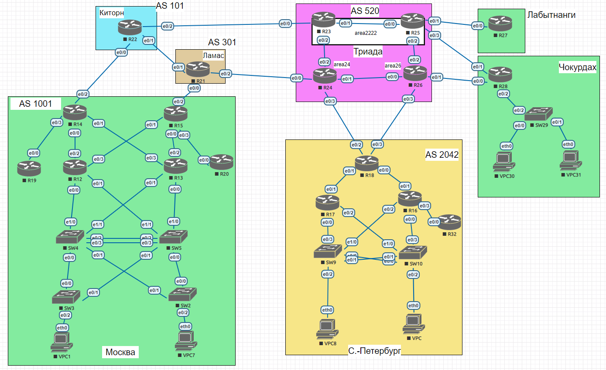

## Задание:

Настроить IS-IS офисе Триада

##  Решение:

- [Конфигурационные файлы;](configs/)
- [Сохраненная топология из EVE-NG;](eve-ng_lab_ISIS.zip)

### Графическая схема

### Адресное пространство:

| Автономка           | IPv4 подсети                                     | IPv6 подсети           |
|---------------------|--------------------------------------------------|------------------------|
| AS520 (Триада)      | 5.20.0.0/16                                      | 2001:DB8:520::/48      |
| AS101 (Киторн)      | 101.0.0.0/16                                     | 2001:DB8:101::/48      |
| AS301 (Ламас)       | 30.1.0.0/16                                      | 2001:DB8:301::/48      |
| AS1001 Москва       | 100.1.0.0/16                                     | 2001:DB8:1001::/48     |
| AS1001 Чокурдах     | 100.1.1.0/24 100.1.10.16/28 100.1.20.16/28 | 2001:DB8:1001:A00::/56 |
| AS1001 Лабытнанги   | 100.1.2.0/24                                     | 2001:DB8:1001:B00::/56 |
| AS2042 С.-Петербург | 20.42.0.0/16                                     | 2001:DB8:2042::/48     |

### IP интерфейсы:

AS520 (Триада)

| Device | Interface                           | IPv4 Address                                                                   | IPv6 Address                                                                                                     |
|--------|-------------------------------------|--------------------------------------------------------------------------------|------------------------------------------------------------------------------------------------------------------|
| **R23**| Lo1 e0/0 e0/1 e0/2         | 5.20.0.23/32 5.20.23.0/31 172.16.1.0/31 172.16.1.2/31                 | 2001:DB8:520::23/128 FE80::23 link-local FE80::23 link-local FE80::23 link-local                        |
| **R24**| Lo1 e0/0 e0/1 e0/2 e0/3 | 5.20.0.24/32 5.20.24.0/31 172.16.1.4/31 172.16.1.3/31 5.20.24.2/31 | 2001:DB8:520::24/128 FE80::24 link-local FE80::24 link-local FE80::24 link-local FE80::24 link-local |
| **R25**| Lo1 e0/0 e0/1 e0/2 e0/3 | 5.20.0.25/32 172.16.1.1/31 5.20.25.0/31 172.16.1.6/31 5.20.25.2/31 | 2001:DB8:520::25/128 FE80::25 link-local FE80::25 link-local FE80::25 link-local FE80::25 link-local |
| **R26**| Lo1 e0/0 e0/1 e0/2 e0/3 | 5.20.0.26/32 172.16.1.5/31 5.20.26.0/31 172.16.1.7/31 5.20.26.2/31 | 2001:DB8:520::26/128 FE80::26 link-local FE80::26 link-local FE80::26 link-local FE80::26 link-local |

### Внесение изменений в конфигурацию:

  
R23

<pre>
!
interface Loopback1
 ip router isis
 ipv6 router isis
!
interface Ethernet0/1
 ip router isis
 ipv6 router isis
!
interface Ethernet0/2
 ip router isis
 ipv6 router isis
!
router isis
 net 49.2222.0520.0000.0023.00
 redistribute static ip
 !
 address-family ipv6
  redistribute static
 exit-address-family
!
no ip route *
ip route 30.1.0.0 255.255.0.0 5.20.23.1
ip route 100.1.0.0 255.255.0.0 5.20.23.1
ip route 101.0.0.0 255.255.0.0 5.20.23.1
!
no ipv6 route 2001:DB8:101::/48 Ethernet0/2 FE80::24 2
no ipv6 route 2001:DB8:101::/48 Ethernet0/1 FE80::25 3
no ipv6 route 2001:DB8:301::/48 Ethernet0/2 FE80::24
no ipv6 route 2001:DB8:301::/48 Ethernet0/1 FE80::25 2
no ipv6 route 2001:DB8:301::/48 Ethernet0/0 FE80::22 3
no ipv6 route 2001:DB8:520::24/128 Ethernet0/2 FE80::24
no ipv6 route 2001:DB8:520::24/128 Ethernet0/1 FE80::25 2
no ipv6 route 2001:DB8:520::25/128 Ethernet0/1 FE80::25
no ipv6 route 2001:DB8:520::25/128 Ethernet0/2 FE80::24 2
no ipv6 route 2001:DB8:520::26/128 Ethernet0/1 FE80::25
no ipv6 route 2001:DB8:520::26/128 Ethernet0/2 FE80::24 2
no ipv6 route 2001:DB8:1001:A00::/56 Ethernet0/2 FE80::24 2
no ipv6 route 2001:DB8:1001:A00::/56 Ethernet0/1 FE80::25
no ipv6 route 2001:DB8:1001:B00::/56 Ethernet0/2 FE80::24 2
no ipv6 route 2001:DB8:1001:B00::/56 Ethernet0/1 FE80::25
no ipv6 route 2001:DB8:1001::/48 Ethernet0/2 FE80::24 2
no ipv6 route 2001:DB8:1001::/48 Ethernet0/1 FE80::25 3
no ipv6 route 2001:DB8:2042::/48 Ethernet0/2 FE80::24
no ipv6 route 2001:DB8:2042::/48 Ethernet0/1 FE80::25 2
ipv6 route 2001:DB8:301::/48 Ethernet0/0 FE80::22
!
</pre>

  
R24

<pre>
!
interface Loopback1
 no shutdown
 ip address 5.20.0.24 255.255.255.255
 ip router isis
 ipv6 address 2001:DB8:520::24/128
 ipv6 router isis
!
interface Ethernet0/1
 ip router isis
 ipv6 router isis
!
interface Ethernet0/2
 ip router isis
 ipv6 router isis
!
router isis
 net 49.0024.0520.0000.0024.00
 redistribute static ip
 !
 address-family ipv6
  redistribute static
 exit-address-family
!
no ip route *
ip route 20.42.0.0 255.255.0.0 5.20.24.3
ip route 30.1.0.0 255.255.0.0 5.20.24.1
ip route 100.1.0.0 255.255.0.0 5.20.24.1
ip route 101.0.0.0 255.255.0.0 5.20.24.1
!
no ipv6 route 2001:DB8:101::/48 Ethernet0/2 FE80::23 2
no ipv6 route 2001:DB8:101::/48 Ethernet0/1 FE80::26 3
no ipv6 route 2001:DB8:301::/48 Ethernet0/2 FE80::23 2
no ipv6 route 2001:DB8:301::/48 Ethernet0/1 FE80::26 3
no ipv6 route 2001:DB8:520::23/128 Ethernet0/2 FE80::23
no ipv6 route 2001:DB8:520::23/128 Ethernet0/1 FE80::26 2
no ipv6 route 2001:DB8:520::25/128 Ethernet0/1 FE80::26
no ipv6 route 2001:DB8:520::25/128 Ethernet0/2 FE80::23 2
no ipv6 route 2001:DB8:520::26/128 Ethernet0/1 FE80::26
no ipv6 route 2001:DB8:520::26/128 Ethernet0/2 FE80::23 2
no ipv6 route 2001:DB8:1001:A00::/56 Ethernet0/2 FE80::23 2
no ipv6 route 2001:DB8:1001:A00::/56 Ethernet0/1 FE80::26
no ipv6 route 2001:DB8:1001:B00::/56 Ethernet0/2 FE80::23 2
no ipv6 route 2001:DB8:1001:B00::/56 Ethernet0/1 FE80::26
no ipv6 route 2001:DB8:1001::/48 Ethernet0/2 FE80::23 2
no ipv6 route 2001:DB8:1001::/48 Ethernet0/1 FE80::26 3
no ipv6 route 2001:DB8:2042::/48 Ethernet0/1 FE80::26 2
no ipv6 route 2001:DB8:2042::/48 Ethernet0/2 FE80::23 3
</pre>

  
R25

<pre>
!
interface Loopback1
 ip router isis 
 ipv6 router isis
!
interface Ethernet0/0
 ip router isis 
 ipv6 router isis
!
interface Ethernet0/2
 ip router isis
 ipv6 router isis
!
router isis
 net 49.2222.0520.0000.0025.00
 redistribute static ip
 !
 address-family ipv6
  redistribute static
 exit-address-family
!
no ip route *
ip route 100.1.1.0 255.255.255.0 5.20.25.3
ip route 100.1.2.0 255.255.255.0 5.20.25.1
ip route 100.1.10.16 255.255.255.240 5.20.25.3
ip route 100.1.20.16 255.255.255.240 5.20.25.3
!
no ipv6 route 2001:DB8:101::/48 Ethernet0/0 FE80::23
no ipv6 route 2001:DB8:101::/48 Ethernet0/2 FE80::26 2
no ipv6 route 2001:DB8:301::/48 Ethernet0/0 FE80::23
no ipv6 route 2001:DB8:301::/48 Ethernet0/2 FE80::26 2
no ipv6 route 2001:DB8:520::23/128 Ethernet0/0 FE80::23
no ipv6 route 2001:DB8:520::23/128 Ethernet0/2 FE80::26 2
no ipv6 route 2001:DB8:520::24/128 Ethernet0/0 FE80::23
no ipv6 route 2001:DB8:520::24/128 Ethernet0/2 FE80::26 2
no ipv6 route 2001:DB8:520::26/128 Ethernet0/2 FE80::26
no ipv6 route 2001:DB8:520::26/128 Ethernet0/0 FE80::23 2
no ipv6 route 2001:DB8:1001:A00::/56 Ethernet0/0 FE80::23 3
no ipv6 route 2001:DB8:1001:A00::/56 Ethernet0/2 FE80::26 2
no ipv6 route 2001:DB8:1001::/48 Ethernet0/0 FE80::23
no ipv6 route 2001:DB8:1001::/48 Ethernet0/2 FE80::26 2
no ipv6 route 2001:DB8:2042::/48 Ethernet0/2 FE80::26
no ipv6 route 2001:DB8:2042::/48 Ethernet0/0 FE80::23 2
!
</pre>

  
R26

<pre>
!
interface Loopback1
 ip router isis
 ipv6 router isis
!
interface Ethernet0/0
 ip router isis
 ipv6 router isis
!
interface Ethernet0/2
 ip router isis
 ipv6 router isis
!
router isis
 net 49.0026.0520.0000.0026.00
 redistribute static ip
 !
 address-family ipv6
  redistribute static
 exit-address-family
!
no ip route *
ip route 20.42.0.0 255.255.0.0 5.20.26.3
ip route 100.1.1.0 255.255.255.0 5.20.26.1
ip route 100.1.10.16 255.255.255.240 5.20.26.1
ip route 100.1.20.16 255.255.255.240 5.20.26.1
!
no ipv6 route 2001:DB8:101::/48 Ethernet0/0 FE80::24
no ipv6 route 2001:DB8:101::/48 Ethernet0/2 FE80::25 2
no ipv6 route 2001:DB8:301::/48 Ethernet0/0 FE80::24
no ipv6 route 2001:DB8:301::/48 Ethernet0/2 FE80::25 2
no ipv6 route 2001:DB8:520::23/128 Ethernet0/0 FE80::24
no ipv6 route 2001:DB8:520::23/128 Ethernet0/2 FE80::25 2
no ipv6 route 2001:DB8:520::24/128 Ethernet0/0 FE80::24
no ipv6 route 2001:DB8:520::24/128 Ethernet0/2 FE80::25 2
no ipv6 route 2001:DB8:520::25/128 Ethernet0/2 FE80::25
no ipv6 route 2001:DB8:520::25/128 Ethernet0/0 FE80::24 2
no ipv6 route 2001:DB8:1001:A00::/56 Ethernet0/0 FE80::24 3
no ipv6 route 2001:DB8:1001:A00::/56 Ethernet0/2 FE80::25 2
no ipv6 route 2001:DB8:1001:B00::/56 Ethernet0/0 FE80::24 2
no ipv6 route 2001:DB8:1001:B00::/56 Ethernet0/2 FE80::25
no ipv6 route 2001:DB8:1001::/48 Ethernet0/0 FE80::24
no ipv6 route 2001:DB8:1001::/48 Ethernet0/2 FE80::25 2
no ipv6 route 2001:DB8:2042::/48 Ethernet0/0 FE80::24 2
no ipv6 route 2001:DB8:2042::/48 Ethernet0/2 FE80::25 3
!
</pre>

