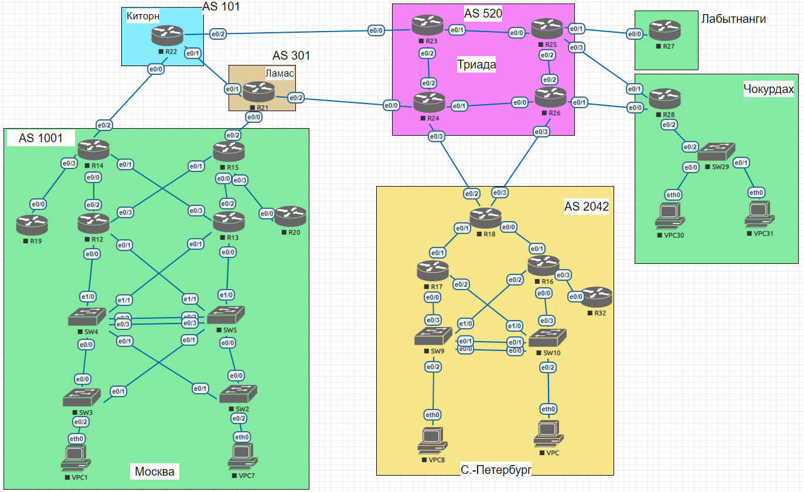

## Задание:

Настроить BGP между автономными системами;
 
Организовать доступность между офисами Москва и С.-Петербург;

##  Решение:

- [Конфигурационные файлы;](configs/)
- [Сохраненная топология из EVE-NG;](eve-ng_lab_eBGP.zip)

### Графическая схема

### Адресное пространство:

| **Автономка**       | **IPv4 подсети**                                 | **IPv6 подсети**       |
|---------------------|--------------------------------------------------|------------------------|
| AS520 (Триада)      | 5.20.0.0/16                                      | 2001:DB8:520::/48      |
| AS101 (Киторн)      | 101.0.0.0/16                                     | 2001:DB8:101::/48      |
| AS301 (Ламас)       | 30.1.0.0/16                                      | 2001:DB8:301::/48      |
| AS1001 Москва       | 100.1.0.0/16                                     | 2001:DB8:1001::/48     |
| AS1001 Чокурдах     | 100.1.1.0/24 100.1.10.16/28 100.1.20.16/28 | 2001:DB8:1001:A00::/56 |
| AS1001 Лабытнанги   | 100.1.2.0/24                                     | 2001:DB8:1001:B00::/56 |
| AS2042 С.-Петербург | 20.42.0.0/16                                     | 2001:DB8:2042::/48     |

### IP интерфейсы:

  
AS520 (Триада)

| **Device** |            **Interface**            |                                **IPv4 Address**                                |                                                                                **IPv6 Address**                                                                                |
|:----------:|:-----------------------------------:|:------------------------------------------------------------------------------:|:------------------------------------------------------------------------------------------------------------------------------------------------------------------------------:|
|   **R23**  |     Lo1 e0/0 e0/1 e0/2     |         5.20.0.23/32 5.20.23.0/31 172.16.1.0/31 172.16.1.2/31         |                                            2001:DB8:520::23/128 FE80::23 link-local FE80::23 link-local FE80::23 link-local                                           |
|   **R24**  | Lo1 e0/0 e0/1 e0/2 e0/3 | 5.20.0.24/32 5.20.24.0/31 172.16.1.4/31 172.16.1.3/31 5.20.24.2/31 | 2001:DB8:520::24/128 FE80::24 link-local, **2001:DB8:520:24E0::24/112** FE80::24 link-local FE80::24 link-local FE80::24 link-local, **2001:DB8:520:24E3::24/112** |
|   **R25**  | Lo1 e0/0 e0/1 e0/2 e0/3 | 5.20.0.25/32 172.16.1.1/31 5.20.25.0/31 172.16.1.6/31 5.20.25.2/31 |                                2001:DB8:520::25/128 FE80::25 link-local FE80::25 link-local FE80::25 link-local FE80::25 link-local                                |
|   **R26**  | Lo1 e0/0 e0/1 e0/2 e0/3 | 5.20.0.26/32 172.16.1.5/31 5.20.26.0/31 172.16.1.7/31 5.20.26.2/31 |                 2001:DB8:520::26/128 FE80::26 link-local FE80::26 link-local FE80::26 link-local FE80::26 link-local, **2001:DB8:520:26E3::26/112**                |

  
AS301 (Ламас)

| **Device** | **Interface**               | **IPv4 Address**                                               | **IPv6 Address**                                                                                                                                                                       |
|------------|-----------------------------|----------------------------------------------------------------|----------------------------------------------------------------------------------------------------------------------------------------------------------------------------------------|
| **R21**    | Lo1 e0/0 e0/1 e0/2 | 30.1.0.21/32 30.1.100.0/31 172.16.1.0/31 5.20.24.1/31 | 2001:DB8:301::21/128 FE80::21 link-local, **2001:DB8:301:21E0::21/112** FE80::21 link-local, **2001:DB8:301:21E1::21/112** FE80::21 link-local, **2001:DB8:520:24E0::21/112** |

  
AS101 (Киторн)

| **Device** | **Interface**               | **IPv4 Address**                                                 | **IPv6 Address**                                                                                                                                        |
|------------|-----------------------------|------------------------------------------------------------------|---------------------------------------------------------------------------------------------------------------------------------------------------------|
| **R22**    | Lo1 e0/0 e0/1 e0/2 | 101.0.0.22/32 101.0.100.0/31 172.16.1.1/31 5.20.23.1/31 | 2001:DB8:101::22/128 FE80::22 link-local, **2001:DB8:101:22E0::22/112** FE80::22 link-local, **2001:DB8:301:21E1::22/112** FE80::22 link-local |

  
AS1001 Москва

| **Device** | **Interface**                                  | **IPv4 Address**                                                                                       | **IPv6 Address**                                                                                                                                 |
|------------|------------------------------------------------|--------------------------------------------------------------------------------------------------------|--------------------------------------------------------------------------------------------------------------------------------------------------|
| **VPC1**   | eth0                                           | 100.1.10.2/28 gw 100.1.10.1                                                                            | 2001:DB8:1001:10::/64 (SLAAC)                                                                                                                    |
| **VPC7**   | eth0                                           | 100.1.20.2/28 gw 100.1.20.1                                                                            | 2001:DB8:1001:20::/64 (SLAAC)                                                                                                                    |
| **SW2**    | Lo1 e0/0 e0/1 vlan20                  | 100.1.0.2/32 172.16.1.27/31 172.16.1.23/31 100.1.20.1/28                                      | 2001:DB8:1001::2/128 FE80::2 link-local FE80::2 link-local 2001:DB8:1001:20::1/64                                                       |
| **SW3**    | Lo1 e0/0 e0/1 vlan10                  | 100.1.0.3/32 172.16.1.21/31 172.16.1.29/31 100.1.10.1/28                                      | 2001:DB8:1001::3/128 FE80::3 link-local FE80::3 link-local 2001:DB8:1001:10::1/64                                                       |
| **SW4**    | Lo1 e0/0 e0/1 e1/0 e1/1 vlan201 | 100.1.0.4/32 172.16.1.20/31 172.16.1.22/31 172.16.1.13/31 172.16.1.19/31 172.16.1.24/31 | 2001:DB8:1001::4/128 FE80::4 link-local FE80::4 link-local FE80::4 link-local FE80::4 link-local FE80::4 link-local               |
| **SW5**    | Lo1 e0/0 e0/1 e1/0 e1/1 vlan201 | 100.1.0.5/32 172.16.1.26/31 172.16.1.28/31 172.16.1.17/31 172.16.1.15/31 172.16.1.25/31 | 2001:DB8:1001::5/128 FE80::5 link-local FE80::5 link-local FE80::5 link-local FE80::5 link-local FE80::5 link-local               |
| **R12**    | Lo1 e0/0 e0/1 e0/2 e0/3            | 100.1.0.12/32 172.16.1.12/31 172.16.1.14/31 172.16.1.1/31 172.16.1.9/31                    | 2001:DB8:1001::12/128 FE80::12 link-local FE80::12 link-local FE80::12 link-local FE80::12 link-local                                |
| **R13**    | Lo1 e0/0 e0/1 e0/2 e0/3            | 100.1.0.13/32 172.16.1.16/31 172.16.1.18/31 172.16.1.7/31 172.16.1.3/31                    | 2001:DB8:1001::13/128 FE80::13 link-local FE80::13 link-local FE80::13 link-local FE80::13 link-local                                |
| **R14**    | Lo1 e0/0 e0/1 e0/2 e0/3            | 100.1.0.14/32 172.16.1.0/31 172.16.1.2/31 101.0.100.1/31 172.16.1.4/31                     | 2001:DB8:1001::14/128 FE80::14 link-local FE80::14 link-local FE80::14 link-local, **2001:DB8:301:22E0::14/112** FE80::14 link-local |
| **R15**    | Lo1 e0/0 e0/1 e0/2 e0/3            | 100.1.0.15/32 172.16.1.6/31 172.16.1.8/31 30.1.100.1/31 172.16.1.10/31                     | 2001:DB8:1001::15/128 FE80::15 link-local FE80::15 link-local FE80::15 link-local, **2001:DB8:301:21E0::15/112** FE80::15 link-local |
| **R19**    | Lo1 e0/0                                    | 100.1.0.19/32 172.16.1.5/31                                                                         | 2001:DB8:1001::19/128 FE80::19 link-local                                                                                                     |
| **R20**    | Lo1 e0/0                                    | 100.1.0.20/32 172.16.1.11/31                                                                        | 2001:DB8:1001::20/128 FE80::20 link-local                                                                                                     |

  
AS1001 Чокурдах

| **Device** | **Interface**                   | **IPv4 Address**                                                | **IPv6 Address**                                                                                   |
|------------|---------------------------------|-----------------------------------------------------------------|----------------------------------------------------------------------------------------------------|
| **VPC30**  | eth0                            | 100.1.10.18/28 gw 100.1.10.17                                   | 2001:DB8:1001:A10::/64 (SLAAC)                                                                     |
| **VPC31**  | eth0                            | 100.1.20.18/28 gw 100.1.20.17                                   | 2001:DB8:1001:A20::/64 (SLAAC)                                                                     |
| **R28**    | Lo1 e0/0 e0/1 e0/2     | 100.1.1.28 5.20.26.1/31 5.20.25.3/31 172.16.1.0/31     | 2001:DB8:1001:AA1::28 FE80::28 link-local FE80::28 link-local FE80::28 link-local         |
| **SW29**   | Lo1 e0/2 vlan10 vlan20 | 100.1.1.29 172.16.1.1/31 100.1.10.17/28 100.1.20.17/28 | 2001:DB8:1001:AA1::29 FE80::29 link-local 2001:DB8:1001:A10::1/64 2001:DB8:1001:A20::1/64 |

  
AS1001 Лабытнанги

| **Device** | **Interface** | **IPv4 Address**              | **IPv6 Address**                                 |
|------------|---------------|-------------------------------|--------------------------------------------------|
| **R27**    | Lo1 e0/0   | 100.1.2.27/32 5.20.25.1/31 | 2001:DB8:1001:BB2::27/128 FE80::27 link-local |

  
AS2042 С.-Петербург

| **Device** | **Interface**                            | **IPv4 Address**                                                                    | **IPv6 Address**                                                                                                                                                                |
|------------|------------------------------------------|-------------------------------------------------------------------------------------|---------------------------------------------------------------------------------------------------------------------------------------------------------------------------------|
| **VPC**    | eth0                                     | 20.42.10.2/28 gw 20.42.10.1                                                         | 2001:DB8:2042:10::/64 (SLAAC)                                                                                                                                                   |
| **VPC8**   | eth0                                     | 20.42.20.2/28 gw 20.42.20.1                                                         | 2001:DB8:2042:20::/64 (SLAAC)                                                                                                                                                   |
| **SW9**    | Lo1 e0/3 e1/0 vlan10 vlan251 | 20.42.0.9/32 172.16.1.11/31 172.16.1.7/31 20.42.10.1/28 172.16.1.14/31  | 2001:DB8:2042::9/128 FE80::9 link-local FE80::9 link-local 2001:DB8:2042:10::1/64 FE80::9 link-local                                                                |
| **SW10**   | Lo1 e0/3 e1/0 vlan20 vlan251 | 100.1.0.10/32 172.16.1.5/31 172.16.1.13/31 100.1.20.1/28 172.16.1.15/31 | 2001:DB8:2042::10/128 FE80::10 link-local FE80::10 link-local 2001:DB8:2042:20::1/64 FE80::10 link-local                                                            |
| **R16**    | Lo1 e0/0 e0/1 e0/2 e0/3      | 20.42.0.16/32 172.16.1.4/31 172.16.1.1/31 172.16.1.6/31 172.16.1.8/31   | 2001:DB8:2042::16/128 FE80::16 link-local FE80::16 link-local FE80::16 link-local FE80::16 link-local                                                               |
| **R17**    | Lo1 e0/0 e0/1 e0/2              | 20.42.0.17/32 172.16.1.10/31 172.16.1.3/31 172.16.1.12/31                  | 2001:DB8:2042::17/128 FE80::17 link-local FE80::17 link-local FE80::17 link-local                                                                                      |
| **R18**    | Lo1 e0/0 e0/1 e0/2 e0/3      | 20.42.0.18/32 172.16.1.0/31 172.16.1.2/31 5.20.24.3/31 5.20.26.3/31     | 2001:DB8:2042::18/128 FE80::18 link-local FE80::18 link-local FE80::18 link-local, **2001:DB8:520:24E3::18/112** FE80::18 link-local, **2001:DB8:520:26E3::18/112** |
| **R32**    | Lo1 e0/0                              | 20.42.0.32/32 172.16.1.9/31                                                      | 2001:DB8:2042::32/128 FE80::32 link-local                                                                                                                                    |

### Внесение изменений в конфигурацию и отображение маршрутов:

  
R14

<pre>
!
interface Ethernet0/2
 ipv6 address 2001:DB8:301:22E0::14/112
!
router bgp 1001
 neighbor 2001:DB8:301:22E0::22 remote-as 101
 neighbor 101.0.100.0 remote-as 101
 !
 address-family ipv4
  network 100.1.0.0 mask 255.255.0.0
  no neighbor 2001:DB8:301:22E0::22 activate
  neighbor 101.0.100.0 activate
 exit-address-family
 !
 address-family ipv6
  network 2001:DB8:1001::/48
  neighbor 2001:DB8:301:22E0::22 activate
 exit-address-family
!
no ip route *
ip route 100.1.0.0 255.255.0.0 Null0
!
no ipv6 route ::/0 Ethernet0/2 FE80::22
ipv6 route 2001:DB8:1001::/48 Null0
!
</pre>

  
R14 show bgp ipv4/6 unicast

<pre>
R14#sh bgp ipv4 unicast
BGP table version is 11, local router ID is 100.1.0.14
...
     Network          Next Hop            Metric LocPrf Weight Path
 *>  0.0.0.0          101.0.100.0                            0 101 i
 *>  5.20.0.0/16      101.0.100.0                            0 101 301 520 i
 *>  20.42.0.0/16     101.0.100.0                            0 101 301 520 ?
 *>  30.1.0.0/16      101.0.100.0                            0 101 301 i
 *>  100.1.0.0/16     0.0.0.0                  0         32768 i
 *>  100.1.1.0/24     101.0.100.0                            0 101 301 520 ?
 *>  100.1.2.0/24     101.0.100.0                            0 101 301 520 ?
 *>  100.1.10.16/28   101.0.100.0                            0 101 301 520 ?
 *>  100.1.20.16/28   101.0.100.0                            0 101 301 520 ?
 *>  101.0.0.0/16     101.0.100.0              0             0 101 i
R14#sh bgp ipv6 unicast
BGP table version is 9, local router ID is 100.1.0.14
...
     Network          Next Hop            Metric LocPrf Weight Path
 *>  ::/0             2001:DB8:101:22E0::22
                                                              0 101 i
 *>  2001:DB8:101::/48
                       2001:DB8:101:22E0::22
                                                0             0 101 i
 *>  2001:DB8:301::/48
                       2001:DB8:101:22E0::22
                                                              0 101 301 i
 *>  2001:DB8:520::/48
                       2001:DB8:101:22E0::22
                                                              0 101 301 520 i
 *>  2001:DB8:1001::/48
                       ::                       0         32768 i
 *>  2001:DB8:1001:A00::/56
                       2001:DB8:101:22E0::22
                                                              0 101 301 520 ?
 *>  2001:DB8:1001:B00::/56
                       2001:DB8:101:22E0::22
                                                              0 101 301 520 ?
 *>  2001:DB8:2042::/48
                       2001:DB8:101:22E0::22
                                                              0 101 301 520 2042 i
</pre>

  
R15

<pre>
!
interface Ethernet0/2
 ipv6 address 2001:DB8:301:21E0::15/112
!
router bgp 1001
 neighbor 30.1.100.0 remote-as 301
 neighbor 2001:DB8:301:21E0::21 remote-as 301
 !
 address-family ipv4
  network 100.1.0.0 mask 255.255.0.0
  neighbor 30.1.100.0 activate
 exit-address-family
 !
 address-family ipv6
  network 2001:DB8:1001::/48
  neighbor 2001:DB8:301:21E0::21 activate
 exit-address-family
!
no ip route *
ip route 100.1.0.0 255.255.0.0 Null0
!
no ipv6 route ::/0 Ethernet0/2 FE80::21
ipv6 route 2001:DB8:1001::/48 Null0
!
</pre>

  
R15 show bgp ipv4/6 unicast

<pre>
R15#sh bgp ipv4 unicast
BGP table version is 320, local router ID is 100.1.0.15
...
     Network          Next Hop            Metric LocPrf Weight Path
 *>  0.0.0.0          30.1.100.0                             0 301 i
 *>  5.20.0.0/16      30.1.100.0                             0 301 520 i
 *>  20.42.0.0/16     30.1.100.0                             0 301 520 2042 i
 *>  30.1.0.0/16      30.1.100.0               0             0 301 i
 *>  100.1.0.0/16     0.0.0.0                  0         32768 i
 *>  100.1.1.0/24     30.1.100.0                             0 301 520 ?
 *>  100.1.2.0/24     30.1.100.0                             0 301 520 ?
 *>  100.1.10.16/28   30.1.100.0                             0 301 520 ?
 *>  100.1.20.16/28   30.1.100.0                             0 301 520 ?
 *>  101.0.0.0/16     30.1.100.0                             0 301 101 i
R15#sh bgp ipv6 unicast
BGP table version is 175, local router ID is 100.1.0.15
...
     Network          Next Hop            Metric LocPrf Weight Path
 *>  ::/0             2001:DB8:301:21E0::21
                                                              0 301 i
 *>  2001:DB8:101::/48
                       2001:DB8:301:21E0::21
                                                              0 301 101 i
 *>  2001:DB8:301::/48
                       2001:DB8:301:21E0::21
                                                0             0 301 i
 *>  2001:DB8:520::/48
                       2001:DB8:301:21E0::21
                                                              0 301 520 i
 *>  2001:DB8:1001::/48
                       ::                       0         32768 i
 *>  2001:DB8:1001:A00::/56
                       2001:DB8:301:21E0::21
                                                              0 301 520 ?
 *>  2001:DB8:1001:B00::/56
                       2001:DB8:301:21E0::21
                                                              0 301 520 ?
 *>  2001:DB8:2042::/48
                       2001:DB8:301:21E0::21
                                                              0 301 520 2042 i
</pre>

  
R18

<pre>
!
interface Ethernet0/2
 ipv6 address 2001:DB8:520:24E3::18/112
!
interface Ethernet0/3
 ipv6 address 2001:DB8:520:26E3::18/112
!
router eigrp SPB
 !
 address-family ipv4 unicast autonomous-system 2042
  !
  topology base
   redistribute bgp 2042 metric 100 1 255 1 1500 route-map REDIST_def
  exit-af-topology
 exit-address-family
 !
 address-family ipv6 unicast autonomous-system 2042
  !
  topology base
   redistribute bgp 2042 metric 100 1 255 1 1500 route-map REDIST_def_v6
  exit-af-topology
 exit-address-family
!
router bgp 2042
 neighbor 5.20.24.2 remote-as 520
 neighbor 5.20.26.2 remote-as 520
 neighbor 2001:DB8:520:24E3::24 remote-as 520
 neighbor 2001:DB8:520:26E3::26 remote-as 520
 !
 address-family ipv4
  network 20.42.0.0 mask 255.255.0.0
  neighbor 5.20.24.2 activate
  neighbor 5.20.26.2 activate
 exit-address-family
 !
 address-family ipv6
  network 2001:DB8:2042::/48
  neighbor 2001:DB8:520:24E3::24 activate
  neighbor 2001:DB8:520:26E3::26 activate
 exit-address-family
!
no ip route *
!
ip prefix-list default_r seq 10 permit 0.0.0.0/0
ip prefix-list default_r seq 20 deny 0.0.0.0/0 le 32
!
no ipv6 route ::/0 Ethernet0/3 FE80::26 2
no ipv6 route ::/0 Ethernet0/2 FE80::24
!
ipv6 prefix-list default_r_v6 seq 10 permit ::/0
ipv6 prefix-list default_r_v6 seq 20 deny ::/0 le 128
!
route-map REDIST_def permit 10
 match ip address prefix-list default_r
route-map REDIST_def deny 20
!
route-map REDIST_def_v6 permit 10
 match ipv6 address prefix-list default_r_v6
route-map REDIST_def_v6 deny 20
!
</pre>

  
R18 show bgp ipv4/6 unicast

<pre>
sh bgp ipv4 unicast
BGP table version is 15, local router ID is 20.42.0.18
...
     Network          Next Hop            Metric LocPrf Weight Path
 *   0.0.0.0          5.20.26.2                              0 520 i
 *>                   5.20.24.2                              0 520 i
 *   5.20.0.0/16      5.20.26.2                0             0 520 i
 *>                   5.20.24.2                0             0 520 i
 *>  20.42.0.0/16     172.16.1.1         1024640         32768 i
 *>  30.1.0.0/16      5.20.26.2               10             0 520 ?
 *                    5.20.24.2                              0 520 301 i
 *>  100.1.0.0/16     5.20.26.2               10             0 520 ?
 *                    5.20.24.2                              0 520 301 1001 i
 *>  100.1.1.0/24     5.20.24.2               10             0 520 ?
 *>  100.1.2.0/24     5.20.26.2               10             0 520 ?
 *                    5.20.24.2               20             0 520 ?
 *>  100.1.10.16/28   5.20.24.2               10             0 520 ?
 *>  100.1.20.16/28   5.20.24.2               10             0 520 ?
 *>  101.0.0.0/16     5.20.26.2               10             0 520 ?
 *                    5.20.24.2                              0 520 301 101 i
R18#sh bgp ipv6 unicast
BGP table version is 31, local router ID is 20.42.0.18
...
     Network          Next Hop            Metric LocPrf Weight Path
 r   ::/0             2001:DB8:520:24E3::24
                                                              0 520 i
 r>                   2001:DB8:520:26E3::26
                                                              0 520 i
 *>  2001:DB8:101::/48
                       2001:DB8:520:24E3::24
                                                              0 520 301 101 i
 *>  2001:DB8:301::/48
                       2001:DB8:520:24E3::24
                                                              0 520 301 i
 *   2001:DB8:520::/48
                       2001:DB8:520:24E3::24
                                                0             0 520 i
 *>                   2001:DB8:520:26E3::26
                                                0             0 520 i
 *>  2001:DB8:1001::/48
                       2001:DB8:520:24E3::24
                                                              0 520 301 1001 i
 *>  2001:DB8:1001:A00::/56
                       2001:DB8:520:24E3::24
                                               10             0 520 ?
 *   2001:DB8:1001:B00::/56
                       2001:DB8:520:24E3::24
                                               20             0 520 ?
 *>                   2001:DB8:520:26E3::26
                                               10             0 520 ?
 *>  2001:DB8:2042::/48
                       FE80::16           1024640         32768 i
</pre>

  
R21

<pre>
!
interface Ethernet0/0
 ipv6 address 2001:DB8:301:21E0::21/112
!
interface Ethernet0/1
 ipv6 address 2001:DB8:301:21E1::21/112
!
interface Ethernet0/2
 ipv6 address 2001:DB8:520:24E0::21/112
!
router bgp 301
 neighbor 5.20.24.0 remote-as 520
 neighbor 30.1.100.1 remote-as 1001
 neighbor 2001:DB8:301:21E0::15 remote-as 1001
 neighbor 2001:DB8:301:21E1::22 remote-as 101
 neighbor 2001:DB8:520:24E0::24 remote-as 520
 neighbor 172.16.1.1 remote-as 101
 !
 address-family ipv4
  network 30.1.0.0 mask 255.255.0.0
  neighbor 5.20.24.0 activate
  neighbor 30.1.100.1 activate
  neighbor 30.1.100.1 default-originate
  neighbor 172.16.1.1 activate
 exit-address-family
 !
 address-family ipv6
  network 2001:DB8:301::/48
  neighbor 2001:DB8:301:21E0::15 activate
  neighbor 2001:DB8:301:21E0::15 default-originate
  neighbor 2001:DB8:301:21E1::22 activate
  neighbor 2001:DB8:520:24E0::24 activate
 exit-address-family
!
no ip route *
ip route 30.1.0.0 255.255.0.0 Null0
!
no ipv6 route 2001:DB8:101::/48 Ethernet0/1 FE80::22
no ipv6 route 2001:DB8:1001:A00::/56 Ethernet0/1 FE80::22 2
no ipv6 route 2001:DB8:1001:A00::/56 Ethernet0/2 FE80::24
no ipv6 route 2001:DB8:1001:B00::/56 Ethernet0/1 FE80::22 2
no ipv6 route 2001:DB8:1001:B00::/56 Ethernet0/2 FE80::24
no ipv6 route 2001:DB8:1001::/48 Ethernet0/0 FE80::15
no ipv6 route 2001:DB8:1001::/48 Ethernet0/1 FE80::22 2
no ipv6 route ::/0 Ethernet0/2 FE80::24
no ipv6 route ::/0 Ethernet0/1 FE80::22 2
ipv6 route 2001:DB8:301::/48 Null0
!
</pre>

  
R21 show bgp ipv4/6 unicast

<pre>
R21#sh bgp ipv4 unicast
BGP table version is 349, local router ID is 30.1.0.21
...
     Network          Next Hop            Metric LocPrf Weight Path
     0.0.0.0          0.0.0.0                                0 i
 *>  5.20.0.0/16      5.20.24.0                0             0 520 i
 *>  20.42.0.0/16     5.20.24.0                              0 520 2042 i
 *>  30.1.0.0/16      0.0.0.0                  0         32768 i
 *   100.1.0.0/16     172.16.1.1                             0 101 1001 i
 *>                   30.1.100.1               0             0 1001 i
 *>  100.1.1.0/24     5.20.24.0               20             0 520 ?
 *>  100.1.2.0/24     5.20.24.0               20             0 520 ?
 *>  100.1.10.16/28   5.20.24.0               20             0 520 ?
 *>  100.1.20.16/28   5.20.24.0               20             0 520 ?
 *>  101.0.0.0/16     172.16.1.1               0             0 101 i
R21#sh bgp ipv6 unicast
BGP table version is 178, local router ID is 30.1.0.21
...
     Network          Next Hop            Metric LocPrf Weight Path
     ::/0             ::                                     0 i
 *>  2001:DB8:101::/48
                       2001:DB8:301:21E1::22
                                                0             0 101 i
 *>  2001:DB8:301::/48
                       ::                       0         32768 i
 *>  2001:DB8:520::/48
                       2001:DB8:520:24E0::24
                                                0             0 520 i
 *>  2001:DB8:1001::/48
                       2001:DB8:301:21E0::15
                                                0             0 1001 i
 *                    2001:DB8:301:21E1::22
                                                              0 101 1001 i
 *>  2001:DB8:1001:A00::/56
                       2001:DB8:520:24E0::24
                                               10             0 520 ?
 *>  2001:DB8:1001:B00::/56
                       2001:DB8:520:24E0::24
                                               20             0 520 ?
 *>  2001:DB8:2042::/48
                       2001:DB8:520:24E0::24
                                                              0 520 2042 i
</pre>

  
R22

<pre>
!
interface Ethernet0/0
 ipv6 address 2001:DB8:101:22E0::22/112
!
interface Ethernet0/1
 ipv6 address 2001:DB8:301:21E1::22/112
!
router bgp 101
 neighbor 2001:DB8:301:21E1::21 remote-as 301
 neighbor 2001:DB8:101:22E0::14 remote-as 1001
 neighbor 101.0.100.1 remote-as 1001
 neighbor 172.16.1.0 remote-as 301
 !
 address-family ipv4
  network 101.0.0.0 mask 255.255.0.0
  neighbor 101.0.100.1 activate
  neighbor 101.0.100.1 default-originate
  neighbor 172.16.1.0 activate
 exit-address-family
 !
 address-family ipv6
  network 2001:DB8:101::/48
  neighbor 2001:DB8:301:21E1::21 activate
  neighbor 2001:DB8:101:22E0::14 activate
  neighbor 2001:DB8:101:22E0::14 default-originate
 exit-address-family
!
no ip route *
ip route 0.0.0.0 0.0.0.0 5.20.23.0
ip route 101.0.0.0 255.255.0.0 Null0
!
no ipv6 route 2001:DB8:301::/48 Ethernet0/1 FE80::21
no ipv6 route 2001:DB8:1001:A00::/56 Ethernet0/1 FE80::21 2
no ipv6 route 2001:DB8:1001:A00::/56 Ethernet0/2 FE80::23
no ipv6 route 2001:DB8:1001:B00::/56 Ethernet0/1 FE80::21 2
no ipv6 route 2001:DB8:1001:B00::/56 Ethernet0/2 FE80::23
no ipv6 route 2001:DB8:1001::/48 Ethernet0/0 FE80::14
no ipv6 route 2001:DB8:1001::/48 Ethernet0/1 FE80::21 2
no ipv6 route ::/0 Ethernet0/1 FE80::21 2
ipv6 route 2001:DB8:101::/48 Null0
!
</pre>

  
R22 show bgp ipv4/6 unicast

<pre>
R22#sh bgp ipv4 unicast
BGP table version is 12, local router ID is 101.0.0.22
...
     Network          Next Hop            Metric LocPrf Weight Path
     0.0.0.0          0.0.0.0                                0 i
 *>  5.20.0.0/16      172.16.1.0                             0 301 520 i
 *>  20.42.0.0/16     172.16.1.0                             0 301 520 ?
 *>  30.1.0.0/16      172.16.1.0               0             0 301 i
 *   100.1.0.0/16     172.16.1.0                             0 301 1001 i
 *>                   101.0.100.1              0             0 1001 i
 *>  100.1.1.0/24     172.16.1.0                             0 301 520 ?
 *>  100.1.2.0/24     172.16.1.0                             0 301 520 ?
 *>  100.1.10.16/28   172.16.1.0                             0 301 520 ?
 *>  100.1.20.16/28   172.16.1.0                             0 301 520 ?
 *>  101.0.0.0/16     0.0.0.0                  0         32768 i
R22#sh bgp ipv6 unicast
BGP table version is 10, local router ID is 101.0.0.22
...
     Network          Next Hop            Metric LocPrf Weight Path
     ::/0             ::                                     0 i
 *>  2001:DB8:101::/48
                       ::                       0         32768 i
 *>  2001:DB8:301::/48
                       2001:DB8:301:21E1::21
                                                0             0 301 i
 *>  2001:DB8:520::/48
                       2001:DB8:301:21E1::21
                                                              0 301 520 i
 *   2001:DB8:1001::/48
                       2001:DB8:301:21E1::21
                                                              0 301 1001 i
 *>                   2001:DB8:101:22E0::14
                                                0             0 1001 i
 *>  2001:DB8:1001:A00::/56
                       2001:DB8:301:21E1::21
                                                              0 301 520 ?
 *>  2001:DB8:1001:B00::/56
                       2001:DB8:301:21E1::21
                                                              0 301 520 ?
 *>  2001:DB8:2042::/48
                       2001:DB8:301:21E1::21
                                                              0 301 520 2042 i
</pre>

  
R23

<pre>
!
no ip route *
ip route 0.0.0.0 0.0.0.0 5.20.23.1
!
no ipv6 route 2001:DB8:101::/48 Ethernet0/0 FE80::22
no ipv6 route 2001:DB8:301::/48 Ethernet0/0 FE80::22
no ipv6 route 2001:DB8:1001::/48 Ethernet0/0 FE80::22
ipv6 route ::/0 Ethernet0/0 FE80::22
!
</pre>

  
R24

<pre>
!
interface Ethernet0/0
 ipv6 address 2001:DB8:520:24E0::24/112
!
interface Ethernet0/3
 ipv6 address 2001:DB8:520:24E3::24/112
!
router isis
 redistribute bgp 520
 !
 address-family ipv6
  redistribute bgp 520
 exit-address-family
!
router bgp 520
 bgp log-neighbor-changes
 neighbor 5.20.24.1 remote-as 301
 neighbor 5.20.24.3 remote-as 2042
 neighbor 2001:DB8:520:24E0::21 remote-as 301
 neighbor 2001:DB8:520:24E3::18 remote-as 2042
 !
 address-family ipv4
  network 5.20.0.0 mask 255.255.0.0
  redistribute isis level-2
  neighbor 5.20.24.1 activate
  neighbor 5.20.24.1 prefix-list FILTER_redist_to_bgp out
  neighbor 5.20.24.3 activate
  neighbor 5.20.24.3 default-originate
  neighbor 5.20.24.3 prefix-list FILTER_redist_to_bgp out
 exit-address-family
 !
 address-family ipv6
  redistribute isis level-2
  network 2001:DB8:520::/48
  neighbor 2001:DB8:520:24E0::21 activate
  neighbor 2001:DB8:520:24E0::21 prefix-list FILTER_redist_to_bgpv6 out
  neighbor 2001:DB8:520:24E3::18 activate
  neighbor 2001:DB8:520:24E3::18 default-originate
  neighbor 2001:DB8:520:24E3::18 prefix-list FILTER_redist_to_bgpv6 out
 exit-address-family
!
no ip route *
ip route 5.20.0.0 255.255.0.0 Null0
!
ip prefix-list FILTER_redist_to_bgp seq 10 deny 172.16.0.0/16 le 32
ip prefix-list FILTER_redist_to_bgp seq 20 permit 5.20.0.0/16
ip prefix-list FILTER_redist_to_bgp seq 21 deny 5.20.0.0/16 le 32
ip prefix-list FILTER_redist_to_bgp seq 30 permit 0.0.0.0/0 le 32
!
no ipv6 route 2001:DB8:101::/48 Ethernet0/0 FE80::21
no ipv6 route 2001:DB8:301::/48 Ethernet0/0 FE80::21
no ipv6 route 2001:DB8:1001::/48 Ethernet0/0 FE80::21
no ipv6 route 2001:DB8:2042::/48 Ethernet0/3 FE80::18
ipv6 route 2001:DB8:520::/48 Null0
!
ipv6 prefix-list FILTER_redist_to_bgpv6 seq 20 permit 2001:DB8:520::/48
ipv6 prefix-list FILTER_redist_to_bgpv6 seq 21 deny 2001:DB8:520::/48 le 128
ipv6 prefix-list FILTER_redist_to_bgpv6 seq 30 permit ::/0 le 128
!
</pre>

  
R24 show bgp ipv4/6 unicast

<pre>
R24#sh bgp ipv4 unicast
BGP table version is 17, local router ID is 5.20.0.24
...
     Network          Next Hop            Metric LocPrf Weight Path
     0.0.0.0          0.0.0.0                                0 i
 *>  5.20.0.0/16      0.0.0.0                  0         32768 i
 *>  5.20.0.23/32     172.16.1.2              20         32768 ?
 *>  5.20.0.25/32     172.16.1.2              30         32768 ?
 *>  5.20.0.26/32     172.16.1.5              20         32768 ?
 *>  20.42.0.0/16     5.20.24.3          1024640             0 2042 i
 *>  30.1.0.0/16      5.20.24.1                0             0 301 i
 *>  100.1.0.0/16     5.20.24.1                              0 301 1001 i
 *>  100.1.1.0/24     172.16.1.5              10         32768 ?
 *>  100.1.2.0/24     172.16.1.2              20         32768 ?
 *>  100.1.10.16/28   172.16.1.5              10         32768 ?
 *>  100.1.20.16/28   172.16.1.5              10         32768 ?
 *>  101.0.0.0/16     5.20.24.1                              0 301 101 i
 *>  172.16.1.0/31    172.16.1.2              20         32768 ?
 *>  172.16.1.6/31    172.16.1.5              20         32768 ?
R24#sh bgp ipv6 unicast
BGP table version is 18, local router ID is 5.20.0.24
...
     Network          Next Hop            Metric LocPrf Weight Path
     ::/0             ::                                     0 i
 *>  2001:DB8:101::/48
                       2001:DB8:520:24E0::21
                                                              0 301 101 i
 *>  2001:DB8:301::/48
                       2001:DB8:520:24E0::21
                                                0             0 301 i
 *>  2001:DB8:520::/48
                       ::                       0         32768 i
 *>  2001:DB8:520::23/128
                       FE80::23                20         32768 ?
 *>  2001:DB8:520::25/128
                       FE80::26                30         32768 ?
 *>  2001:DB8:520::26/128
                       FE80::26                20         32768 ?
 *>  2001:DB8:1001::/48
                       2001:DB8:520:24E0::21
                                                              0 301 1001 i
 *>  2001:DB8:1001:A00::/56
                       FE80::26                10         32768 ?
 *>  2001:DB8:1001:B00::/56
                       FE80::26                20         32768 ?
 *>  2001:DB8:2042::/48
                       2001:DB8:520:24E3::18
                                          1024640             0 2042 i
</pre>

  
R26

<pre>
!
interface Ethernet0/3
 ipv6 address 2001:DB8:520:26E3::26/112
!
router isis
 redistribute bgp 520
 !
 address-family ipv6
  redistribute bgp 520
 exit-address-family
!
router bgp 520
 neighbor 5.20.26.3 remote-as 2042
 neighbor 2001:DB8:520:26E3::18 remote-as 2042
 !
 address-family ipv4
  network 5.20.0.0 mask 255.255.0.0
  redistribute isis level-2
  neighbor 5.20.26.3 activate
  neighbor 5.20.26.3 default-originate
  neighbor 5.20.26.3 prefix-list FILTER_redist_to_bgp out
 exit-address-family
 !
 address-family ipv6
  redistribute isis level-2
  network 2001:DB8:520::/48
  neighbor 2001:DB8:520:26E3::18 activate
  neighbor 2001:DB8:520:26E3::18 default-originate
  neighbor 2001:DB8:520:26E3::18 prefix-list FILTER_redist_to_bgpv6 out
 exit-address-family
!
no ip route 20.42.0.0 255.255.0.0 5.20.26.3
ip route 5.20.0.0 255.255.0.0 Null0
!
ip prefix-list FILTER_redist_to_bgp seq 10 deny 172.16.0.0/16 le 32
ip prefix-list FILTER_redist_to_bgp seq 20 permit 5.20.0.0/16
ip prefix-list FILTER_redist_to_bgp seq 21 deny 5.20.0.0/16 le 32
ip prefix-list FILTER_redist_to_bgp seq 30 permit 0.0.0.0/0 le 32
!
no ipv6 route 2001:DB8:2042::/48 Ethernet0/3 FE80::18
ipv6 route 2001:DB8:520::/48 Null0
ipv6 route 2001:DB8:1001:A00::/56 Ethernet0/1 FE80::28
!
ipv6 prefix-list FILTER_redist_to_bgpv6 seq 20 permit 2001:DB8:520::/48
ipv6 prefix-list FILTER_redist_to_bgpv6 seq 21 deny 2001:DB8:520::/48 le 128
ipv6 prefix-list FILTER_redist_to_bgpv6 seq 30 permit ::/0 le 128
!
</pre>

  
R26 show bgp ipv4/6 unicast

<pre>
R26#sh bgp ipv4 unicast
BGP table version is 14, local router ID is 5.20.0.26
...
     Network          Next Hop            Metric LocPrf Weight Path
     0.0.0.0          0.0.0.0                                0 i
 *>  5.20.0.0/16      0.0.0.0                  0         32768 i
 *>  5.20.0.23/32     172.16.1.4              30         32768 ?
 *>  5.20.0.24/32     172.16.1.4              20         32768 ?
 *>  5.20.0.25/32     172.16.1.6              20         32768 ?
 *>  20.42.0.0/16     5.20.26.3          1024640             0 2042 i
 *>  30.1.0.0/16      172.16.1.4              10         32768 ?
 *>  100.1.0.0/16     172.16.1.4              10         32768 ?
 *>  100.1.2.0/24     172.16.1.6              10         32768 ?
 *>  101.0.0.0/16     172.16.1.4              10         32768 ?
 *>  172.16.1.0/31    172.16.1.6              20         32768 ?
 *>  172.16.1.2/31    172.16.1.4              20         32768 ?
R26#sh bgp ipv6 unicast
BGP table version is 21, local router ID is 5.20.0.26
...
     Network          Next Hop            Metric LocPrf Weight Path
     ::/0             ::                                     0 i
 *>  2001:DB8:520::/48
                       ::                       0         32768 i
 *>  2001:DB8:520::23/128
                       FE80::24                30         32768 ?
 *>  2001:DB8:520::24/128
                       FE80::24                20         32768 ?
 *>  2001:DB8:520::25/128
                       FE80::25                20         32768 ?
 *>  2001:DB8:1001:B00::/56
                       FE80::25                10         32768 ?
 *>  2001:DB8:2042::/48
                       2001:DB8:520:26E3::18
                                          1024640             0 2042 i
</pre>

